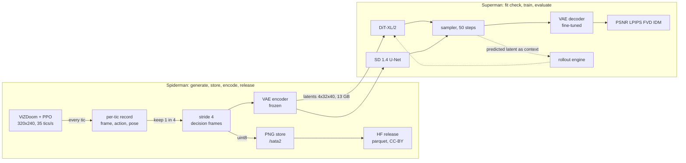
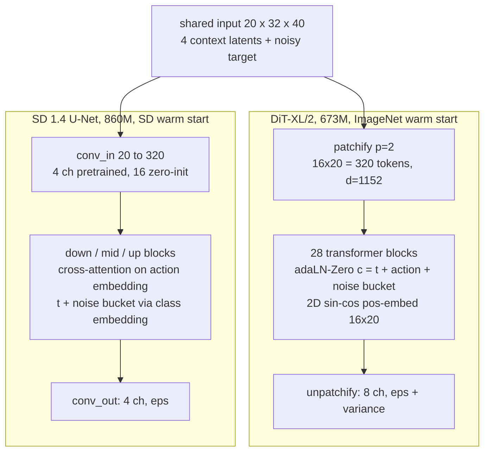

# DoomDiT technical plan

> Draft 1, Sep 8, 2026. Rendered version with diagrams: https://claude.ai/code/artifact/3a3e186d-5dcc-400c-9d26-27417ebfd086 (private artifact). Companion: `REQUIREMENTS.md`. This file is the text of record; the artifact adds figures.

One question drives the design: what changes when the U-Net in a GameNGen-style Doom world model is replaced by a Diffusion Transformer, with everything the two backbones see held identical. Every stage before the backbone is shared and frozen; every stage after it is shared and applied the same way to both.

## 1. Data generation

- Source: ViZDoom, `deathmatch_simple.wad` with bots, public PPO agent from `arnaudstiegler/gameNgen-repro`. Six buttons expand to 18 legal combinations. Screen 320x240 RGB24, HUD on, weapon on, crosshair off. Freedoom assets, so frames are releasable.
- Tics and stride: 35 tics/s; the agent acts every 4th tic and the action is held. The April set stored every tic (4-frame context = 0.11 s, target 29 ms ahead, so copy-last is strong). Now: one decision frame per action, stride 4; context = 4 decision frames = 0.46 s; conditioning action = the action recorded at the last context frame, which is the one held until the target. This removes the action-offset ambiguity.
- Recorded per decision frame: PNG frame, action (0..17, applied from this frame to the next), health, ammo, x, y, angle, map, episode, tic. Every tic is also kept as PNG on `/sata2` (about 350 GB) since generation runs once.
- Size: 5M tics, about 1.25M decision frames, about 950 episodes of 150 s. Split by episode, 10% held out, fixed seed, `data/split.json`.
- Release: parquet shards under 1 GB with PNG bytes plus the columns above (the arnaudstiegler layout, viewer works, no loading script). CC-BY-4.0, data card. Decision-frame version first (about 90 GB).

## 2. Latent space and VAE

`stabilityai/sd-vae-ft-mse` (SD KL-f8, MSE-weighted fine-tune). Why: (1) both warm starts, ImageNet DiT-XL/2 and SD 1.4, were trained on this latent family at scale 0.18215, and warm starting is what makes the 16 GB budget work (20x loss drop in the first 1k steps in April); (2) GameNGen used the SD 1.4 autoencoder, so the same bottleneck sits under both papers; (3) ft-mse reconstructs flat, low-noise frames like Doom's more faithfully than ft-ema.

Geometry: pad the image 320x240 to 320x256 before encoding (GameNGen's choice), latent (4, 32, 40), 320 tokens at patch 2, crop after decoding. 245,760 pixel values become 5,120 latent values, a 48x bottleneck. The bottom 32 rows are the HUD.

Decoder fine-tuning (GameNGen section 3.2.2): encoder frozen, decoder trained with MSE against lossless target frames on a 50k-frame training subset, lr 1e-5. Report full-frame and HUD-crop PSNR/LPIPS before and after on held-out frames. The frozen encoder keeps the latent both backbones learn on fixed.

Alternatives rejected: SDXL VAE (different latent statistics, breaks both warm starts); DC-AE / SANA 32x autoencoder (32x8x10 latent, too coarse for HUD digits, no warm start); a game-specific VQ tokenizer (different model class); pixel space (20,480 tokens).

## 3. The two backbones

Shared input: 20 channels at 32x40 (4 context latents = 16 ch, noisy target = 4 ch). Shared loss, sampler, data, steps, batch.

DiT-XL/2: depth 28, hidden 1152, 16 heads, patch 2. Patch projection inflated 4 to 20 input channels (pretrained on the first 4, zero-init on the rest). Positional embedding rebuilt as 2D sin-cos on 16x20. Label embedder replaced by an 18-way action table plus a 10-way noise-bucket table, summed into the adaLN vector with the timestep embedding. Learned variance kept (pretrained 8-channel head). Tokens 80 to 320: attention 16x, MLP 4x, expect 4 to 5x slower per step than April.

SD 1.4 U-Net: diffusers `UNet2DConditionModel`, `conv_in` inflated the same way. Action: 18x768 embedding through the cross-attention slots text used (GameNGen's construction). Noise bucket: `class_labels` with `num_class_embeds=10`, added to the timestep embedding. Epsilon only, fixed variance.

Accepted asymmetries, stated in the paper: conditioning pathway (adaLN vs cross-attention, each backbone's native one) and output head (learned vs fixed variance). Parameter count is not forced to match (673M vs 860M): both are the published sizes with usable pretrained weights; compute is matched by steps, batch, resolution. Parameter-matched from-scratch pair is the P1 second row.

## 4. Conditioning and augmentation

- Context: four decision frames, channel-stacked. 8 or 16 as a DiT-only P1 ablation.
- Action: single action at the last context frame; 10% dropout kept for CFG, unused at eval.
- Noise augmentation on the context, both backbones (GameNGen): Gaussian noise at a random level up to 0.7, 10 buckets, bucket fed as conditioning; small fixed level at inference. DiT ablation without it is the most informative P1 row for rollout metrics.

## 5. Training recipe

| setting | value | why |
|---|---|---|
| objective | DDPM 1000, linear beta, epsilon prediction | April recipe; what both warm starts were trained with |
| loss | MSE on eps; DiT adds the variational term for learned variance | standard per family |
| global batch | 32 | April recipe |
| optimizer | fused AdamW, wd 0, warmup 500, clip 1.0 | April recipe |
| learning rate | DiT 1e-4, U-Net 5e-5 (D7) | published fine-tuning values; 2k-step check at half and double if time |
| precision | bf16 autocast, fp32 master, EMA 0.9999 fp32 | 16 GB; bf16 EMA underflows |
| memory | grad checkpointing on, per-GPU batch 4 with accumulation | confirmed by the fit check |
| steps | 90k target, 50k floor, equal for both | fit check decides; done by Sep 24 |
| checkpoint selection | best held-out latent MSE every 5k steps | April used train loss with no split |
| seeds | one per backbone, same seed | two only if early |

## 6. Sampling and rollouts

The April code says "DDIM 50" but calls `p_sample_loop` on a respaced schedule: ancestral DDPM with learned variance. Both are flags now. Recommendation: respaced DDPM 50 for teacher-forced numbers (continuity), DDIM 50 eta 0 for rollouts (deterministic given the seed, so drift compares backbones not sampler noise), both reported once.

Rollout engine: 4 real seed latents plus GT actions; predict, append, drop the oldest, repeat H = 64. All predicted latents are written once per checkpoint; drift, FVD, and IDM read that file. 256 rollouts x 64 is about 16k sampler calls, roughly 80 minutes on one A4000.

## 7. Evaluation

| metric | protocol | answers |
|---|---|---|
| PSNR, LPIPS teacher-forced | 2,048 held-out windows vs raw lossless frame; AlexNet LPIPS, VGG once | GameNGen-comparable quality |
| copy-last | last context frame as prediction | learned dynamics at all? |
| VAE ceiling | decode(encode(GT)) vs GT, before/after decoder fine-tune | how much is the autoencoder |
| drift curves | PSNR/LPIPS at horizon 1..64, 256 rollouts | stability over time |
| FVD16, FVD32 | I3D on decoded predicted clips vs real, N >= 256 | rollout realism |
| IDM action accuracy | 1M-param conv net on latent pairs, trained on real pairs; ceiling on real held-out; top-1 and movement-only | does the rollout obey the action |
| HUD crop PSNR, health-digit agreement (P1) | bottom 32 rows; template matching | the part GameNGen fixed |

Quality bar, fixed before the runs. Must: DiT beats U-Net on LPIPS and drift at horizon 32; both beat copy-last. Should: LPIPS <= 0.25 at 320x240 on held-out. Stretch: PSNR >= 29 dB (GameNGen: 70M frames, 64-frame context; not expected, and the paper says why).

## 8. Compute and servers

**Fit check, measured Sep 9 (Superman A4000 16 GB, L = 32, global batch 32, fp32 AdamW, gradient checkpointing, velocity objective):**

| backbone | per-GPU batch | GPUs | steps/s | peak memory | 90k steps |
|---|---|---|---|---|---|
| DiT-XL/2 (675M with new heads) | 4 | 1 | 0.39 | 11.6 GB | 64 h |
| DiT-XL/2 | 8 | 1 | 0.50 | 11.8 GB | 50 h |
| DiT-XL/2 | 8 | 4 (torchrun) | 0.93 incl. startup | 12.8 GB | about 24 h, likely less |
| SD 1.4 U-Net (860M) | 4 | 1 | 0.30 | 14.8 GB | 83 h; about 45 h on 2 GPUs |

Both fit without 8-bit optimizers. Launch plan within the six-GPU cap: DiT on four GPUs (batch 8, no accumulation), U-Net on two (batch 4, accumulation 4). Note: `accelerate launch` fails on Superman (libstdc++ / optree); use `torchrun --nproc_per_node N`.

Spiderman: 64 cores and 503 GB RAM for generation (about 1 h for 5M tics on 16 processes), `/sata2/data` 7.3 TB free for the PNG store, a 3 GB A6000 slice for the encoder (about 2 h) and decoder fine-tune (about 2 h), HF upload, checkpoint archive. All four A6000s are busy with other users' training, so no long runs there.

Superman: six idle A4000 16 GB. Fit check (30 min), DiT on 4 GPUs (about 3.5 days at the expected 0.3 steps/s for 90k), U-Net on 2 or sequential, evaluation on 1 GPU (about 3 h per checkpoint). Disk 37 GB: latents 13, warm-start weights 3, one rolling checkpoint per run, older checkpoints rsynced to Spiderman. Moving the 22 GB SAM render tree off Superman gives headroom.

Fallback if the fit check fails at 320 tokens: 256x192 (192 tokens) for both, or Spiderman when a GPU frees.

## 9. Decisions to agree on

| # | decision | recommendation |
|---|---|---|
| D1 | VAE | sd-vae-ft-mse, encoder frozen, decoder fine-tuned with MSE on 50k frames; LPIPS+MSE variant P1 |
| D2 | resolution and padding | 320x240 padded to 320x256 at image level; latent 4x32x40; crop after decode |
| D3 | stride, context, action | stride 4, four decision frames, action at the last context frame |
| D4 | noise augmentation | both backbones, max 0.7, 10 buckets; inference level chosen on val drift (P1), else 0 |
| D5 | conditioning pathway | native each: adaLN for DiT, cross-attention plus class embedding for U-Net; stated |
| D6 | output head | DiT learned variance, U-Net eps only; stated, not ablated |
| D7 | learning rate | DiT 1e-4, U-Net 5e-5; 2k-step check at half and double if time |
| D8 | steps | equal; 90k if >= 0.3 steps/s, else 50k |
| D9 | sampler | respaced DDPM 50 teacher-forced, DDIM 50 eta 0 rollouts, both reported once |
| D10 | evaluation sizes | 2,048 windows; 256 rollouts x 64; FVD 16 and 32; IDM with ceiling |
| D11 | dataset release | HF parquet with PNG bytes, CC-BY-4.0, decision-frame version first; PRO for the upload month |
| D12 | servers | Spiderman generates, stores, encodes, archives; Superman trains and evaluates |
| D13 | maps | one arena; add a Freedoom2 map only if the agent test passes |
| D14 | checkpoint selection | best held-out latent MSE every 5k steps |

## 10. Risks and fallback triggers

- Fit check under 0.2 steps/s or OOM at batch 4: 256x192 for both, or Spiderman when a GPU frees.
- U-Net warm start with 20-channel conv_in trains poorly (loss not below April's 20k level by 10k steps): report at equal steps anyway; that is the comparison.
- Superman disk under 20 GB at launch: move the 22 GB SAM render tree to `/sata2` first.
- Runs slip past Sep 24 (under 50k steps by Sep 22): evaluate latest checkpoints at equal steps with a caveat.
