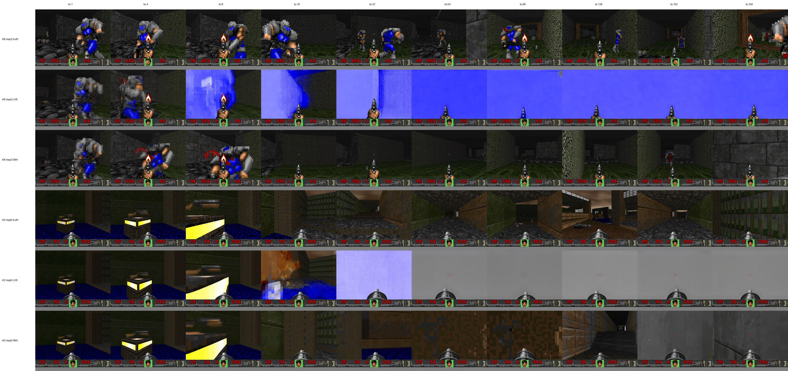
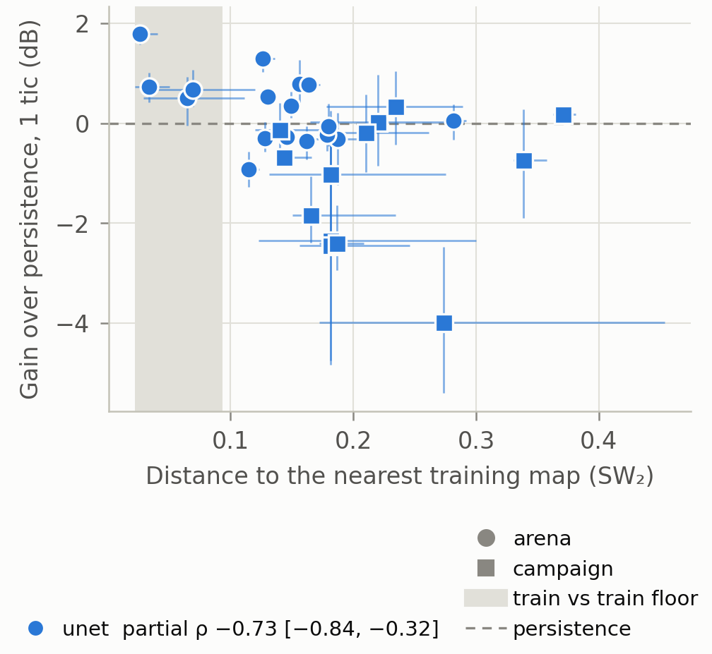

# DoomDiT: researcher's dossier

A reading companion and experiment ledger for Rohan Nagabhirava. It teaches the project from the documents: what is learned, why each evaluation is defined the way it is, what every completed experiment establishes and does not, the decisions and their reasons, and where our evidence sits beside GameNGen, DIAMOND, MultiGen, PlayGen, Oasis and the open reproductions.

**Cutoff:** Sep 26 2026, 12:00 EDT: main at `2cdff5a`, plus the PixArt 150k and 155k periodic reads that main relayed for the 12:00 EDT log entry. Every number is stated once, in its final corrected form. Where two sources disagree, the later one is used and the disagreement is named once.

**Source tags.** `[RC 09-26 11:30]` is the entry of that date and time (EDT) in section 7 of `RESEARCH_CONTEXT.md`; `[RC §0]` is its section 0. `[rates]` is `results/sd35_stability/collapse_rates_50k_130k.md`. `[stats]` is `results/distance_study/figure_unet_h1/stats.json`, and `[dist-sd1]`, `[dist-pix]`, `[dist-sd35]` are `results/distance_study/distances_{sd1,pixels,sd35}.json`. `[memo]` is `.claude/analyses/distance-study-design-2026-09-24.md` and `[lit]` is `.claude/analyses/distance-study-literature-2026-09-25.md`. `[G]`, `[M]`, `[D]`, `[P]`, `[DF]`, `[SF]`, `[O]` are GameNGen (arXiv 2408.14837v2), MultiGen (2603.06679v2), DIAMOND (2405.12399v2), PlayGen (2412.00887v1), Diffusion Forcing (2407.01392v4), Self Forcing (2506.08009v2) and Open Oasis. "Derived" marks arithmetic done for this dossier from cited numbers. `$D` is `/sata2/data/rnagabhi/doom` on Spiderman.

---

# 0. State of the project, Sep 26

*A reader can stop after this section.*

**The paper.** CoRL 2026 PhysWM workshop, 4 pages, deadline Sep 30 AoE. Authors Rohan Nagabhirava and Keerthana Chirumamilla. Draft to Changliu Sunday Sep 27 evening, with SD 3.5 numbers marked provisional; final tables Sep 28 to 29. [RC §0; RC 09-25 13:25]

## 0.1 The spine

1. **A matched three-backbone comparison.** SD 1.4 U-Net (4-channel latents), SD 3.5 Medium (a DiT, 16-channel latents) and PixArt-alpha (a DiT, 4-channel latents) train as Doom world models under one recipe on one public dataset: every tic (35 Hz), 32 tics of context, the executed-control history, v-prediction, 200k updates of batch 32. The rows land within about 0.7 dB of each other at one tic, so the backbone table is the main table but not the whole contribution. The findings came from how we evaluate.
2. **Persistence-referenced evaluation.** Every score sits beside copy-last-frame persistence on the same windows. At 35 Hz consecutive frames are nearly identical, so persistence is a strong baseline and a raw PSNR means little without it. All three rows beat it on held-out episodes of the training maps. On maps the model never trained on, the U-Net loses to it at one tic on 17 of 26 maps. None of the 2024 to 2026 game and driving world models we checked reports such a reference; 2014 to 2019 video prediction routinely did. [lit Q4]
3. **The map-distance generalization result.** Each evaluation map's footage becomes a motion-weighted cloud of frame latents, and its distance is the sliced Wasserstein distance to the nearest training map. Over 30 maps the U-Net's gain over persistence falls with that distance: partial Spearman −0.73, 95% CI [−0.84, −0.32] at one tic, −0.80 [−0.88, −0.46] at four tics, permutation p = 0.0001, the same sign in all 30 leave-one-map-out refits. It replicates on pixel distances (−0.66) and on SD 3.5 latent distances (−0.73). It lives between maps, not between episodes of one map (ρ = +0.09, p = 0.22). The test and the distances were frozen before any map was scored. The pre-declared gate still prints "does not support", because two distance sanity checks fail; that ruling is open. [stats; section 7]
4. **The closed-loop stability finding.** Under autoregression, SD 3.5's live weights intermittently fall into absorbing states: one latent channel's mean is captured at a fixed value while the latent's overall scale stays normal, and the frames go blank. The fp32 EMA weights fall in less often. Over 50k to 130k, a frame drops under 10 dB in 16.7 percent of live rollouts (48 of 288) and 7.1 percent of EMA rollouts (25 of 352); the rollout ends under 12 dB in 12.8 against 2.6 percent, and ends with channel 13 captured in 8.3 against 1.7 percent. [rates] The live-versus-EMA gap is concentrated at 50k and 70k; on matched windows late in training the two weight sets fail at the same rate (section 6.4). The paper states rates per weight set and per training window, not "the EMA never fails".
5. **The directional check.** On real turning windows, swapping TURN_LEFT and TURN_RIGHT in the newest control reverses the predicted camera motion in 87 percent of windows for the U-Net at 200k and 84 percent for the SD 3.5 EMA (100k and 130k), with about the true magnitude. Neither model learned plain persistence. [RC 09-25 02:10; RC 09-26 11:30]

## 0.2 Current numbers

Validation episodes of the four training maps (ids 6000:6100), 512 teacher-forced windows, 10-step DDIM, stock decoders, raw target frames. "Gain" is model PSNR minus persistence PSNR on the same windows. Rollouts are 16 of 256 tics from the same episodes; copy-seed holds the last real context frame for the whole rollout.

| Row, weights | 1 tic PSNR / LPIPS | Gain | 4 tics PSNR / LPIPS | Gain | 256-tic rollout PSNR | Minus copy-seed |
|---|---|---:|---|---:|---|---:|
| Persistence (copy last frame) | 21.57 / 0.203 | 0 | 19.21 / 0.354 | 0 | copy-seed 17.52 | 0 |
| U-Net 200k EMA (final) | 22.49 / 0.177 | +0.92 | 21.33 / 0.224 | +2.11 | 17.81 | +0.29 |
| U-Net 200k live | 22.29 / 0.186 | +0.72 | 20.97 / 0.244 | +1.76 | 15.87 | −1.65 |
| SD 3.5 130k EMA | 23.21 / 0.135 | +1.64 | 21.52 / 0.199 | +2.31 | 17.70; seed-1 windows 17.25 | +0.18; −0.21 |
| SD 3.5 130k live | not recorded (120k: 22.95 / 0.146) | | not recorded (120k: 21.24 / 0.222) | | 17.86 | +0.34 |
| PixArt 155k EMA | 22.41 / 0.184 | +0.84 | 21.24 / 0.235 | +2.02 | no rollout read yet | |
| PixArt 155k live | 22.30 / 0.189 | +0.73 | 20.94 / 0.250 | +1.73 | | |

Sources: U-Net [RC 09-24 18:40]; SD 3.5 [RC 09-26 10:50, 11:30, 05:40]; PixArt [RC 09-26 12:00, read from `results_spiderman/041-pixart-nexttic/eval_0155000/*/metrics.json`]. The seed-1 rollouts draw different validation windows, whose own copy-seed is 17.46. SD 3.5 passed the U-Net's final LPIPS at 40k and both final U-Net numbers at 50k (22.56 / 0.163). [RC 09-25 23:15] The SD 3.5 130k gains and the U-Net live gains are derived.

Two caveats travel with every row. SD 3.5 decodes through a better autoencoder (about 27.5 against 23.5 dB reconstruction on validation frames), so part of its lead is rendering, not dynamics. And none of these windows come from maps the models did not train on; section 7 holds that evidence.

## 0.3 Runs and ETAs

| Run | Card (Spiderman) | State at cutoff | 200k |
|---|---|---|---|
| `040-unet-nexttic` | GPU 1, since given to PixArt | Stopped at 200k on Sep 24 17:09 EDT; last validation loss 0.1509 | Done |
| `041-pixart-nexttic` | GPU 1 | 160k at 12:00; 1.0 to 1.36 updates/s | Tonight, Sep 26; final read follows (supersedes "early Sunday" of RC 09-25 23:15) |
| `042-sd35-nexttic` | GPU 2 | 133.4k at 11:30; 0.50 to 0.54 updates/s | Sep 27, about 21:30 to 23:00 EDT (21:30 from RC §0; 23:00 derived from 133.4k at 0.52 updates/s) |
| Steward 7 reads | GPU 3 | Every 5k: teacher-forced reads, two-seed EMA rollouts, probe_v2, directional; EMA seed-2 backfill on surviving snapshots; PixArt 150k rollout read running | |

Every run streams to W&B project `doomdit-nexttic`. `/sata2` had 265 GB free and `/home` 10 GB at 10:15. [RC 09-26 10:30, 11:30, 12:00; RC §0]

## 0.4 Open decisions (Rohan's)

1. **The verdict gate** of the distance study. Two of its five distance checks fail (section 7.3). Main's position: check (iv) is an assumption about the maps, not a check of the measurement, and check (ii) is a subset tolerance stricter than the precision the test relies on. The gate was not changed after the data. Astra reviews the question today at 13:28. [RC 09-25 11:30; `.claude/analyses/astra-brief-2026-09-26.md`]
2. **Which SD 3.5 weights to release.** The matched table stays at 200k for every row. Choosing the released SD 3.5 checkpoint by validation-rollout stability instead is legitimate, because the rollouts use validation windows, not test. [RC 09-26 09:00]
3. **The post-training experiment** on GPU 1 after PixArt: four 3k-step arms against the absorbing states (section 6.6). Astra reviews the design at 13:28. [RC 09-26 10:30]
4. **Deletions** on `/sata2`: `hf_release_arnold` (202 GB) and `raw_arnold` (202 GB), both verified on the Hub, and `latents_arnold_sd35` (41 GB), 445 GB in all. An armed ladder deletes the first two if free space reaches 150 GB. [RC 09-25 13:15, 22:15]
5. **GPU 2 after SD 3.5 stops.** Proposal: a 6,000-episode U-Net row. It needs a 250 GB re-download of the 4-channel 2000:6000 set, a hard-linked 6,000-episode directory and a gate run. [RC §0; RC 09-24 22:50]
6. **Smaller:** the sealed-corpora rule for the distance study's fixed-checkpoint reads (section 2.5); a word to hengjinz about GPU 1; `ServerAliveInterval 15` and `ServerAliveCountMax 2` in the multiplexed SSH block (section 10.3).

A new analytical point for the stability claim came out of writing this dossier (section 6.4). The late rise of the pooled EMA event rate coincides with a harder window set joining the reads at 105k. On the standing seed-0 windows the EMA rate is flat: 3.1 percent at 55k to 100k, 4.2 percent at 105k to 130k. A trend test needs the same windows at early and late checkpoints.

---

# 1. The task, and why PSNR needs a persistence reference

## 1.1 What is being learned

DoomDiT learns the next frame of the game given recent frames and the controls the engine executed. Everything happens in an autoencoder's latent space: an encoder E maps each 320×240 frame (padded to 320×256) to a latent z, the model predicts the next latent, and a decoder renders it for display and scoring.

For target row r the contract is p(z_r | z_{r−32:r}, u_{r−32:r}). Here u_t is the executed control that takes the engine from frame t toward frame t+1, so the last conditioning control u_{r−1} is the one that produces the target. The control u_r is future information and never enters. Our recorder stores each frame with its *outgoing* control before stepping the engine; other datasets store the *incoming* control, so copying their array offsets would silently change the causal task. [`record_arnold.py:255–273`; `doom_data.py:725–746`]

Two ways of running the model answer different questions:

- **Teacher forcing** feeds real past frames as context and scores one prediction. It measures one-step fidelity. "h1" and "h4" below mean predicting one or four tics past the last real frame.
- **Autoregressive rollout** feeds each prediction back as context, with the recorded controls, for 256 tics (about 7.3 game-seconds). It measures whether errors compound. The engine supplies neither frames nor state during a rollout.

The model is a visual simulator with finite memory. It does not run Doom's geometry, collision, ammunition or damage rules; it infers what it needs from pixels and controls. So several failure modes are distinct and no single scalar captures them: a plausible image can ignore the control, a smooth rollout can freeze the camera, and a correct movement can score badly because an enemy did something else. That is why the evaluation is a battery (section 4): teacher-forced fidelity, rollouts against copy-seed, a directional control test, and per-map scores tied to distance from the training footage.

## 1.2 PSNR, and why it needs a task definition

PSNR is 10·log10(MAX²/MSE) for one image pair; we average it over images. It depends on the reference image, the temporal gap, the crop, the sampler and the aggregation, so a PSNR without those is not a result. [`eval_tf.py:34–43,314–320`]

**Persistence** predicts the next frame by copying the last real frame. Its PSNR measures how much the footage changes over the gap, which is a property of the data, not of any model. It is a baseline, not a lower bound: a poor model scores below it. It moves a lot with the gap. On a 20,000-pair sample of our arenas 2 to 5 it scores 21.78 dB at one tic, 20.35 at two, 19.02 at four and 18.19 at eight; arena 5 alone runs 20.34 at one tic and arena 4 23.05. [`results/night_2026-09-19/q2-verify-dense/stats_arenas.json`] The open GameNGen-reproduction footage is easier still: 23.79 dB at one tic against 21.59 on our seen footage, sampled the same way. [`results/night_2026-09-19/q4-repro-footage/TABLE.md:3–22`] So PSNRs from different gaps or different footage are scores on different tasks.

**Gain over persistence** is model PSNR minus persistence PSNR on the same windows. Per window it equals 10·log10(MSE_persistence / MSE_model), so the footage's motion level cancels to first order and what remains is what the model adds over copying. It has the algebraic form of Genie's ΔtPSNR, which differences two PSNRs against a counterfactual predictor. [lit Q5]

**Three references appear in our metrics files, and the suffix names the target, not the prediction:**

| Field | Prediction | Target | Use |
|---|---|---|---|
| `persist_psnr_raw` | raw last frame | raw next frame | the decoder-free persistence reference; the only one used for gains |
| `copy_psnr_raw` | decoded last latent, D(E(I_{t−1})) | raw next frame | carries the autoencoder's reconstruction error; historical |
| reconstruction | decoded target latent, D(E(I_t)) | raw target | the "VAE ceiling"; a diagnostic of rendering error, not a bound on what a predictor can score |

The decoded copy scores lower than raw persistence, by 1.36 dB on average over the 30 evaluation maps and by up to 4.04 dB on static campaign maps (derived from the frozen per-map metrics). Using it as the reference inflates gains, unevenly across maps. The distance study's first look made exactly that mistake (section 7.6). [`eval_tf.py:278–303`]

**Rollout references.** Copy-seed holds the last real context frame for every horizon; beating it means the rollout is closer to the truth than freezing the game. Copy-last uses the real frame one tic before each target, so it reads the truth and is not an open-loop competitor; it only shows local difficulty. [review M4 in `docs/REVIEW_2026-09-22.md`]

## 1.3 What "stronger than GameNGen" can and cannot mean

GameNGen reports 29.43 dB and 0.249 LPIPS, teacher-forced, on 2,048 held-out trajectory samples from five levels, sampled with four DDIM steps. [G §§3.3, 5.1] Its footage, weights and training code are not public, so we cannot score it on our windows or ours on its windows. Matching its step count leaves the data, gap, autoencoder, decoder and sampling of windows different. Subtracting each dataset's persistence improves interpretation but does not create a common benchmark. [G §5.1; RC 09-22 09:15]

The class-project headline, 26.04 dB and 0.153 LPIPS, was measured on training segments, and the released checkpoint saw all 500 episodes, so it has no honest held-out number. [RC 09-02] The rebuilt project therefore claims what it can control: an open, reproducible recipe and dataset; a matched comparison on it; and an evaluation that exposes persistence and decoder effects that a headline PSNR hides.

---

# 2. The data

## 2.1 Recording: Arnold, every tic

The footage comes from ViZDoom with Freedoom assets, played by Arnold, a public pretrained deathmatch agent (Lample and Chaplot), against bots, with the HUD and crosshair visible. `record_arnold.py` stores every engine tic losslessly: the frame, then the control it is about to send, then the engine steps. Episodes run 150 game-seconds nominally. The engine does not render the respawn interval, so each death removes about 39 stored tics; a fit gives a baseline near 5,286 rows per episode. The minimum-length filter was lowered from 4,800 to 4,600 rows so that it would not reject episodes merely for having more deaths. [`release/DENSE_CORPUS.md:85–94`]

**Why Arnold.** A released agent and an inspectable engine interface make the pipeline reproducible end to end. The cost is a different behaviour distribution from GameNGen, whose PPO agent was recorded throughout its learning, weak and strong phases included. Arnold is one fixed policy plus scripted anti-stuck overrides. Map diversity does not substitute for diversity of competence. [G §3.1; RC 09-09]

**Why every tic.** The first corrected rows (the "stride-four" rows, section 5.5) predicted verified decision frames four tics apart. Two findings moved the project to every tic on Sep 20. Persistence depends strongly on the gap (section 1.2), so stride-four PSNRs answer a different, harder question than any consecutive-frame model. And a global four-tic grid is unsafe for Arnold: deaths and anti-stuck behaviour shift its action phase, so only 11,427 of 30,841 action-run starts in a sample fell on the global phase, against 44,616 of 44,616 in the reproduction footage. [Q4 `TABLE.md:47–71`; RC 09-20 21:45] A next-tic window only needs consecutive tics, an unchanged death counter and an unchanged map; it keeps held actions and override transitions instead of rejecting them. [`doom_data.py:465–514,591–746`]

## 2.2 The corpus and the split

The dense corpus uses Arnold's own published map split: training arenas 2 to 5 and test arenas 6 to 8. An earlier idea of training on arenas 3, 10, 12 and 13, chosen from favourable per-map scores, was rejected because it would make the dataset depend on the outcome. [`release/DENSE_CORPUS.md:9–17`]

| Pool | Content |
|---|---|
| `arenas` | 8,000 episodes, 2,000 per arena 2 to 5; 40,285,059 tics, about 319.7 recorded hours at 35 Hz |
| `arenas_678` | 3,000 episodes, 1,000 per arena 6 to 8; about 14.8M tics; never trained on |

The split is by episode, in half-open id ranges, and frozen in `release/dense_split.json`:

| Purpose | Ids | Episodes |
|---|---|---|
| Training pool | `arenas` 0:6000 | 6,000 (1,500 per arena) |
| Validation pool | `arenas` 6000:7000 | 1,000 |
| Test pool | `arenas` 7000:8000 | 1,000 |
| **Trained on by every row** | `arenas` 0:2000 | 2,000 (500 per arena); 10,070,779 rows |
| **Validation subset used for all reads** | `arenas` 6000:6100 | 100 (25 per arena); 503,864 rows |
| Sealed test subset | `arenas` 7000:7100 | 100; 503,620 rows; never scored |
| Unseen scoring subset | `arenas_678` 60:120 | 60 (20 per arena) |

Of the U-Net's 10,006,779 candidate training windows, 9,661,754 are valid; the 3.45 percent excluded cross a life boundary. [RC 09-23 06:30] At batch 32 one pass is about 300k updates, so 200k updates see about two thirds of one pass (derived). The 2000:6000 episodes were encoded later on Superman in both latent spaces, in a separate tree so the certified training directories stayed unchanged, and uploaded to their own Hub folders. The whole dataset is public on Hugging Face. [RC 09-24 22:50; RC §0]

**Why the unseen subset moved to ids 60:120.** Arnold's weapon-select requests execute only in each recorder worker's first episode (section 2.3). `arenas_678` was started three times, so its ids 0:60 held 51 worker-first episodes, against none in validation and test and 32 (1.6 percent) in the training prefix. Scoring 0:60 would have mixed map transfer with a control regime the models barely saw. Ids 60:120 hold none. The replacement was declared on Sep 22, before any model was scored on either set. [`docs/REVIEW_2026-09-22.md` H1]

## 2.3 Requested versus executed controls: the mechanism and the repair

The raw `buttons` field is the control list Arnold *requested*. It is not what the engine executed, for two reasons.

**The mechanism.** Arnold's action builder exposes nine controls: forward, backward, turn left, turn right, move left, move right, attack, speed, crouch. Its `add_buttons` appends ten weapon-selection names to the same shared list *at every game start*, and the recorder starts a game per episode, so the requested list grows by ten each episode in a worker. ViZDoom deduplicates buttons at registration, so the engine's vector stays 19 wide; it reads the first 19 entries of a longer request, zero-fills a shorter one, and ignores the tail. [Arnold `actions.py:197–199,298`, `game.py:485`; ViZDoom 1.2.4 `ViZDoomGame.cpp:151–158,367–372`] The executed control is therefore

```python
executed = requested[:19].ljust(19, "0")
```

A weapon request sits at index 9 + 10k + j, where j is the weapon slot and k is the number of *previous* game starts in that worker. Only k = 0, the worker's first episode, places it inside the executed range. In later episodes Arnold's weapon requests are silently ignored, while movement and firing still execute and pickups can still change weapons. The dataset records what the engine did under the controls it consumed; it is not a record of Arnold with the bug fixed. [`transitions.py:32,41–89`; `release/DATASET_CARD.md:98–108`]

**The full-corpus count** (8,000 episodes, 40,285,059 rows): raw request widths reach 2,507 characters; 11.0 percent of rows are wider than 19; 3,286 rows carry an executed weapon switch, all in the first episode of each of the 32 workers; 4,424,593 switch requests went unexecuted; the maximum inferred prior-start count is 249, which is 8,000 episodes over 32 workers, exactly as the mechanism predicts. [RC 09-22 13:00] Requested and executed controls agree on 89 percent of tics. Almost all of the rest are dropped weapon requests, and only 0.15 percent are true anti-stuck overrides. [RC 09-24 18:40]

**The repair.** Encoded sidecars store the fixed-width executed string plus `buttons_raw_len` and `switch_requested_index`; the raw parquet stays untouched so the original request is preserved. The repair checks row counts, tics and normalised controls against the raw data, writes atomically and does not re-encode images. The loader refuses wide old sidecars rather than loading a huge control matrix. Two wrong fixes were rejected: remapping an overflow bit into an executed slot (claims a switch the engine ignored) and keeping only the nine base controls (drops real executed switches). [`transitions.py:82–149`; `doom_data.py:562–588`; RC 09-22 11:30]

**Consequence for the experiment plan.** A planned ablation conditioning on requested controls was dropped: with 89 percent identity and 0.15 percent true overrides it would most likely be null. [RC 09-24 18:40]

## 2.4 The evaluation corpus and how its maps were fixed

The distance study (section 7) scores 30 maps, 342 episodes in all:

| Group | Maps | Episodes per map | Source |
|---|---|---:|---|
| Training arenas, held-out episodes | 2, 3, 4, 5 | 25 | validation ids 6000:6100 |
| Same-WAD test arenas | 6, 7, 8 | 20 | `arenas_678` 60:120 |
| Other arenas | 1, 9 to 15 (`seen`) | 4 | seeded corpus |
| Other arenas | 16, 17 (`unseen`) | 10 | seeded corpus |
| Campaign maps (another WAD) | 18 to 20, 22 to 26, 28 to 32 (`unseen2`) | 10 | seeded corpus |

That is 17 arena maps and 13 campaign maps. The seeded evaluation corpus holds 210 episodes (60 `seen` on maps 1 to 15, 20 `unseen`, 130 `unseen2`), all encoded per tic in both latent spaces with the pinned encoder. Its copies of maps 2 to 8 replicate the distance measurement rather than adding points. "Seen" is a historical name: those arenas trained the April model, not any next-tic row. [RC §0; RC 09-25 09:40; dist-sd1 `maps`]

**How map selection was fixed.** The arena split is Arnold's. The campaign maps were curated on Sep 16 for a deathmatch-style experiment: monsters and some pickups removed, maps where the agent got stuck excluded. That is a disclosed, curated distribution, not a random sample of Doom maps, and it was fixed before any next-tic result existed. [RC 09-16 15:40, 17:10]

## 2.5 The seal

Test data is sealed so that no choice is made after looking at it. The evaluator seals the test corpus at first access, pins the whole scoring configuration at selection time, and treats `arenas_678`, `seen`, `unseen` and `unseen2` as sealed reporting corpora. [RC 09-23 00:50; `after_nexttic.sh`] The distance scorer read those corpora once, with the U-Net's final 200k EMA weights, so no checkpoint selection could happen; it refuses the test corpus and wrote nothing into the seal registry `$R/sealed`. Whether such fixed-checkpoint reads count as the corpus's single scoring is Rohan's open ruling. [RC 09-25 01:25, 09:40]

The historical decoders were fine-tuned on frames that included held-out maps, so all next-tic reads use the stock decoders, which have seen no Doom map. [RC 09-21 14:30]

---

# 3. The recipe

All three rows share one recipe and differ only in backbone and latent space. [RC 09-21 01:30; RC 09-23 06:30; RC 09-24 20:35]

| | SD 1.4 U-Net | SD 3.5 Medium | PixArt-alpha 512 |
|---|---|---|---|
| Run | `040-unet-nexttic` | `042-sd35-nexttic` | `041-pixart-nexttic` |
| Architecture | convolutional U-Net | MMDiT (joint-attention transformer) | DiT with cross-attention |
| Latent space | SD 1.x, 4 channels | SD 3.5, 16 channels | SD 1.x, 4 channels |
| Parameters | 860.5M | 2,271.7M | 628M |
| Control tokens enter via | cross-attention, width 768 | joint attention, width 4,096, plus a 2,048-d pooled slot from the newest control | cross-attention tokens (`--action-inject token`), width 4,096 |
| Memory at batch 32 | 23.3 GB, no checkpointing | 36.8 GB, gradient checkpointing | 26.8 GB, no checkpointing |
| Throughput alone | 1.78 to 1.83 updates/s | 0.50 to 0.55 updates/s | about 1.4 updates/s |
| Launched | Sep 23 06:28 EDT | Sep 23 09:04 EDT | Sep 24 20:32 EDT |

Shared settings: public pretrained weights (never our earlier Doom checkpoints, which would add in-domain exposure and the old stride); training ids 0:2000; fused AdamW at 5e-5 after 2,000 warmup updates, weight decay 0, clip norm 1.0; global batch 32 on one card with no gradient accumulation; bf16 autocast with fp32 parameters and EMA; seed 0; action dropout 0; validation loss every 1,000 updates on 1,024 fixed windows, overall and by timestep quartile; recovery checkpoints every 5k and snapshots every 10k. The U-Net fills only half of its 48 GB A6000, but a larger micro-batch would change the recipe's global batch, so the fill-the-card rule does not apply. SD 3.5 is compute-bound (GPU at 100 percent, CPU 93 percent idle), and gradient checkpointing costs it about a third of its speed. [RC 09-23 06:30; RC 09-24 21:05]

## 3.1 Channel-stacked latents

The 32 context latents are concatenated with the noisy target latent along the channel axis, so time is not a separate token axis; the backbone sees one tall image-like tensor. The pretrained input projection is inflated with zero-initialised weights for the new context channels, which preserves the pretrained function on the target at initialisation. The new control embeddings still change downstream activations, so the network does not start as exactly the pretrained model. [`backbones.py:241–259,344–388`] This is GameNGen's visual-context design, with 32 frames instead of 64; GameNGen's own ablation gains only 0.05 dB from 32 to 64 frames. [G Table 2] At 35 Hz, 32 tics span 0.914 s nominally (0.886 s between the oldest and newest frame), against 3.66 s for the stride-four rows, so long-range memory is weaker by design.

## 3.2 The two latent spaces

The SD 1.x autoencoder (`sd-vae-ft-mse`, 8× downsampling) maps a padded 320×256 frame to 4×32×40 with scale 0.18215. The SD 3.5 autoencoder gives 16×32×40 with shift 0.0609 and scale 1.5305. Padding rows are cropped before every decode so only the 240 real rows are scored. [`encode_parquet.py:155–189`; `backbones.py:34–74`] The 16-channel space reconstructs our validation frames at about 27.5 dB against 23.5 dB for the 4-channel space (stock decoders; section 3.7's alignment gate). That gap belongs to the SD 3.5 row as a system: its lead mixes a better representation with its backbone. A Flux autoencoder, also 16 channels, is not interchangeable, because its scale and shift differ.

## 3.3 Controls as tokens

Each of the 32 executed 19-bit controls passes through a shared MLP, gets a learned position embedding, and enters the backbone as a token. This adopts GameNGen's history-token idea without claiming its undisclosed vocabulary or encoding. [`backbones.py:153–217,771–790`] The ImageNet DiT's conditioning path instead averages the control embeddings before adaLN (adaptive layer normalisation, where the conditioning sets per-channel scale and shift), and an average of embeddings with additive positions cannot see the order of the controls. [`backbones.py:153–181,290–307`] PixArt took the third slot because it is a text-to-image DiT like the other two and was the best transformer of the stride-four run; a DiT-XL/2 row stays Rohan's call. [RC 09-24 18:40]

## 3.4 v-prediction and the schedule

The network predicts the *velocity* v = √ᾱ_t·ε − √(1−ᾱ_t)·x₀, a mix of the noise ε and the clean latent x₀ whose weighting changes with the noise level ᾱ_t. Velocity targets stay well-scaled at both ends of the noise range; GameNGen uses the same target. The loss is an unweighted MSE with t drawn uniformly. [`diffusion_v.py:38–102`; G §3.2]

The schedule is 1,000 linear betas from 1e-4 to 0.02, kept from the earlier rows for continuity. It is not either backbone's native schedule. SD 1.4 uses a "scaled-linear" schedule with terminal ᾱ about 4.7e-3 against our 4.0e-5, so 273 of our timesteps are noisier than anything SD 1.4 saw in pretraining. SD 3.5 was pretrained with rectified flow, a different interpolation and target altogether. The paper discloses the mismatch; no schedule ablation was run, and the schedule is hard-coded at eight call sites, so changing it would be a new training experiment. [RC 09-21 14:30; `.claude/analyses/astra-prelaunch-audit-2026-09-21.md`]

## 3.5 Noise augmentation and its bucket-zero subtlety

Noise augmentation corrupts the *context* during training so that the model's own imperfect predictions look less foreign when they are fed back during a rollout. Our form is c̃ = √(1−q)·c + √q·ε, with one level q per example drawn uniformly below 0.7 and shared across its 32 context frames. The level is quantised into ten buckets of width 0.07, and the bucket id is embedded so the model knows how noisy its context is. At q = 0.7 the signal and noise coefficients are 0.548 and 0.837. GameNGen states the 0.7 maximum and ten buckets but not the formula; the Stiegler reproduction adds noise instead of blending. [`diffusion_v.py:135–151`; G §3.2.1]

**The subtlety.** Inference uses clean context with bucket 0. But bucket 0 covers q in [0, 0.07), and a continuous uniform draw hits exactly q = 0 with probability zero, so clean context is a boundary case the model never trained on exactly. A proposal to give exactly-clean context 10 percent of training mass was withdrawn: it would change the training distribution and the bucket semantics relative to the earlier rows, and it is not a disclosed GameNGen detail. [RC 09-21 14:30]

**Why augmentation stayed.** GameNGen's no-augmentation model diverges within 10 to 20 generated frames. [G §5.2.2, Figure 7] Our stride-four "noaug" cell instead improved teacher-forced fidelity and action accuracy at a cost in FVD (section 5.5). Both can be true; the recipe kept augmentation because the next-tic rows run much longer rollouts. Section 6 shows its limit: it does not prevent the absorbing states, whose errors are structured shifts of a channel's mean rather than the isotropic noise it trains on.

## 3.6 fp32 EMA

An EMA (exponential moving average) keeps a second copy of the weights, θ_EMA ← d·θ_EMA + (1−d)·θ, which averages the live weights over recent training. The trainer applies decay 0.9999 per update in steps of eight (d = 0.9999⁸ every eighth update), a time constant of about 10,000 updates. The arithmetic is fp32 because a bf16 update with weight 1e-4 underflows and freezes the average, which was the class project's bug. [`train_wm.py:419–422,819–820`]

Early in training the EMA still contains the public start weights: a share of 0.9999^s, about 0.61 at 5k, 0.37 at 10k and 0.14 at 20k. So the EMA scores badly at first (U-Net EMA 11.76 dB at 5k against live 21.15) and passes the live weights once the start has washed out, by 40k for the U-Net. [RC 09-23 11:30] Every read scores live and EMA weights from the same saved file. Reported samples in the paper use the EMA.

## 3.7 Launch gates and the certificate

Nothing trains until `scripts/cluster/gates.sh` passes on the machine and checkout that will run it. The gates, in order: sidecar controls against the raw recordings; training inventory; latent alignment; emitted training windows; yaw alignment of controls against camera motion on validation; a 20-update memory fit; a 300-step smoke with checkpoints; conditioning probes; a 10-update resume that restores optimizer, scheduler, EMA and random state; and a readback of the smoke snapshot through the evaluator. Passing prints `GATES_GO` and a `GATES_LAUNCH` line; the certificate `$D/GATES_CERT.json` records the resolved command, commit, data fingerprints and encoder records per backbone. The launcher refuses any start or resume that differs from its certified entry. [RC 09-23 00:50 to 04:40; `.claude/analyses/launch-runbook-2026-09-23.md`]

**Latent alignment** is the gate that catches an off-by-one between frames and controls. It re-encodes stored frames and compares them with the stored latents (MAE at most 5e-3, p99 at most 2e-2), then decodes the stored latents against raw frames unshifted and shifted by ±1 and ±4 rows; the unshifted score must win by at least 2 dB. The 2 dB floor was set after a correctly aligned, bit-identical 4-channel validation shard cleared only 2.91 dB: at one tic, a neighbouring frame is almost as good a match on slow footage, so the margin is bounded by per-tic motion. The MAE and p99 tolerances test misalignment independently. SD 3.5's latents were encoded on Superman's A4000s and re-encoded by the gate on Spiderman's A6000s; the cross-host differences were rounding-sized (largest MAE 19 percent of tolerance). All sampled shards passed, with margins 2.91 to 4.52 dB in the 4-channel space and 4.85 to 6.85 dB in the 16-channel space. These are sampled checks, not a proof for every row. [`check_latent_alignment.py:22–73`; `$D/GATES.txt`; RC 09-23 04:05, 04:40]

**How the gates got here.** Four review rounds on Sep 22 to 23 closed 21 defects: the independent review's seven findings, then Astra's eight, three and three reproduced defects. Examples: the launcher accepted an SD 3.5-only certificate for a U-Net launch; a smoke at lr 5e-5 certified a launch at lr 0.1; two concurrent evaluators could both score the sealed test set. A separate launch blocker surfaced only because a 300-step pre-smoke ran on real data: one memory map per episode against Spiderman's soft limit of 1,024 open files, fixed by raising the limit before loading. [RC 09-23 00:20 to 04:40, 03:00; `doom_data.py:198`] The rows launched from a second checkout, `$D/repo_launch` at `35258f3`, because encoders were still running from `$D/repo`; PixArt later launched from `repo_launch2` at `f5386f1`. The gates certify the training contract, not model quality: the 300-step U-Net readback scored 18.38 dB against 21.92 persistence.

## 3.8 Native W&B

Every run streams training loss, validation loss (overall and by quartile), gradient norm, throughput, memory and every evaluation read to W&B project `doomdit-nexttic`. The trainer does this by default through `wandb_log.RunLogger`; only the gates' throwaway runs pass `--no-wandb`. `periodic_eval.py` gives the trainer its own reads every N steps on another card. [RC 09-23 19:45; RC 09-24 21:55] The U-Net and SD 3.5 rows are pinned to `35258f3`, which predates native logging, so a sidecar, `tools/wandb_tail.py`, replays their `log.jsonl` and steward files. PixArt, launched before the init fix below, also streams through a sidecar (`041-pixart-nexttic-tail`). The fix: `wandb.init` starts subprocesses on the calling thread while the trainer forks DataLoader workers, and a worker forked in that window held a pipe open and hung the init; `11540db` moves setup before the fork. [RC 09-24 21:55]

---

# 4. The evaluation instruments

Each instrument answers one question. Reading a number needs its instrument, its weights (live or EMA) and its windows.

## 4.1 Teacher-forced reads (h1, h4)

`eval_tf.py --tic-stride 1` scores 512 windows from validation ids 6000:6100, drawn with seed 0 and identical at every step for every row. Sampling is 10-step DDIM with linear spacing, eta 0 and clean context; each space uses its stock decoder; targets are raw frames. Horizons are one tic (h1) and four tics (h4) past the last real frame; for h4 the model starts from real context and rolls forward tic by tic, feeding its own three intermediate predictions back, so h4 is a four-step closed loop with the recorded controls. [`eval_tf.py:281–284`] Persistence on these windows is 21.566 dB / 0.203 LPIPS at h1 and 19.213 / 0.354 at h4, the same for every row. [RC 09-23 11:30]

LPIPS is a learned perceptual distance (lower is better) that penalises blur and texture loss that PSNR tolerates, so every PSNR is reported with it. The metrics files carry an independent-window standard error (0.095 dB for a live h1 PSNR), which understates the uncertainty because the 512 windows share 100 episodes. No read yet has an episode-bootstrap interval. [`steward_5000/tf_live_h1/metrics.json`]

## 4.2 Why 10 sampling steps: the sampler sweep

DDIM is a deterministic diffusion sampler that denoises along a subset of the trained timesteps, so the step count trades compute for fidelity. Fewer steps land a sample near the *conditional mean* of possible next frames, which is blurred. A blurred mean wins MSE, hence PSNR, and loses LPIPS. That is the perception-distortion trade, and the sweep shows it at every checkpoint. [RC 09-23 19:00; RC 09-24 10:30, 18:40]

U-Net 200k, live weights, h1, the 512 validation windows (persistence 21.57 / 0.203):

| Steps | Linear spacing PSNR / LPIPS | Trailing spacing PSNR / LPIPS |
|---:|---|---|
| 4 | 22.35 / 0.272 | 22.37 / 0.245 |
| 8 | 22.34 / 0.199 | 22.32 / 0.193 |
| 10 | 22.29 / 0.186 | not run |
| 16 | 22.20 / 0.171 | not run |
| 50 | 22.04 / 0.162 | not run |

More steps lower PSNR and improve LPIPS. Spacing matters only at 4 steps. The step count at which the U-Net beats persistence in LPIPS fell from 16 at 50k to 8 at 200k. At 200k, 10 steps flatter PSNR by about 0.25 dB against 50 steps (0.36 dB at 10k). All reads and the distance study use 10 steps; the choice is a documented point on this curve, not the PSNR-best setting. The sweep is teacher-forced, U-Net only; the SD 3.5 sweeps planned at 50k and 100k were not recorded. [RC 09-24 18:40]

GameNGen's step table moves differently: its PSNR rises 7 dB from 1 to 4 steps and then holds (25.47 at 1, 32.58 at 4, 32.19 at 64), and its LPIPS is flat after 4. Our 4 uniform-in-t steps on a linear schedule put two of four network calls at almost pure noise, and GameNGen samples with observation guidance 1.5 that our models cannot use (no observation dropout in training). So our 4-step point is not a reproduction of its 4-step setting. [G Table 1, §3.3; `docs/REVIEW_2026-09-22.md` M1]

## 4.3 Rollouts, copy-seed and per-rollout events

`rollout_eval.py` runs 16 rollouts of 256 tics from validation episodes with the recorded executed controls, clean context and 10-step DDIM, feeding each predicted latent back as context. It scores raw frames at 4, 32, 64, 128 and 256 tics. Seed 0 draws the standing windows; seed 1 draws a second set, run on the EMA at every read from 115k (and at 105k); seed 2 is the backfill on surviving snapshots. Every full read keeps the rollout arrays (`npz`), so events can be counted after the fact. [RC 09-26 03:30, 09:00]

On the seed-0 windows copy-seed scores 18.93 / 17.47 / 17.60 / 17.80 / 17.52 dB at 4 / 32 / 64 / 128 / 256 tics, with LPIPS 0.317 / 0.487 / 0.505 / 0.502 / 0.520. The seed-1 windows' copy-seed is 19.11 / 18.07 / 17.94 / 17.50 / 17.46. [RC 09-25 01:40, 22:15] Copy-seed's LPIPS stays strong at long horizons because a frozen real frame is sharp; a model that drifts toward a smooth static frame can beat copy-seed in PSNR and lose in LPIPS.

A mean over 16 rollouts hides whether one rollout collapsed or all degraded a little, so the stability claim is counted per rollout:

- **(a)** any frame under 10 dB raw PSNR (a near-blank frame);
- **(b)** PSNR under 12 dB at tic 256 (the rollout ends broken);
- **(c)** latent channel 13's per-frame mean under −0.9 at tic 256 (the captured end state; the channel's data range is −0.44 to 0.80).

Earlier reads also counted crossings of a line 3 dB under the EMA's mean curve. [rates; RC 09-25 01:40] A rollout needs its seed and its whole horizon inside one life; on 12 audited episodes that excluded 34 percent of 256-tic candidates against 3.7 percent at one tic, so rollouts describe surviving stretches of play. [review M4]

## 4.4 The control probe, and why its maximum misleads

`smoke_probe.py` flips all 19 bits of the newest control and reports the largest absolute change in the v-prediction, at fixed noise, context and t = 500, over one batch of four windows. It proves the output depends on the newest control. It does not measure control strength. An all-bits-flipped control is something the recorder can never produce, so the probe measures the response to an off-manifold token, and a one-element maximum is a tail statistic.

The maximum rose 3.8 times from 60k to 65k, fell back at 70k and reached 71.0 at 75k, which looked like a learning event. Commit `caf58bb` added the mean and 99th percentile of the change field ("probe_v2"), which showed the whole field moving at 75k, with the mean 15 to 30 times its 70k value. Meanwhile real control swaps (section 4.5), teacher-forced reads and rollouts stayed normal. The reading: the jump is an extrapolation property of the control embedding off the data manifold. The rule since then flags a probe jump only if it pairs with a directional drop or a live collapse. [RC 09-24 23:30; RC 09-25 04:30, 05:00]

probe_v2 means (three seeds) swing by 30 times between reads: 0.16 / 0.18 / 0.18 at 105k, 7.7 / 14.9 / 5.2 at 130k (the largest, seed-1 maximum 140), while the directional check held at 0.82 to 0.87 from 75k on. That contrast is the evidence for the extrapolation reading. An alternation (high at odd multiples of 5k, low at multiples of 10k) held from 60k to 125k with 80k and 105k as exceptions, and broke at 130k; it is recorded, not explained. [RC 09-26 03:30, 10:50, 11:30]

## 4.5 The directional check and its estimator validation

`directional_check.py` (`999f6b2`) asks whether the dependence on the control has the right *sign*. It takes validation windows whose newest control holds exactly one of TURN_LEFT and TURN_RIGHT and no strafe, predicts each window twice from the same noise with the two turn bits swapped in the newest control only, and measures each predicted frame's horizontal shift against the last context frame. The shift comes from normalised cross-correlation over ±32 px on rows 48 to 120 of a central crop, refined to sub-pixel by a parabola fit; a left turn slides the scene right (positive). `correct_frac` is the fraction of windows whose predicted shift reverses under the swap. A motion ratio compares predicted with true motion over four closed-loop tics; persistence scores 0 by construction. Each run uses 64 windows per direction. [RC 09-25 00:45, 02:10]

**The estimator is validated first.** `ref_frac` is the fraction of windows in which the *ground-truth* next frame moves the way the control says. It reads 0.91 to 0.92 on decoded frames and 0.90 on raw frames, so the shift estimator and the sign convention work before any model is judged. [RC 09-25 02:10, 05:00]

| Row, weights | correct_frac | Median shift, recorded control, left / right (px) | Median shift, swapped | Motion ratio |
|---|---:|---|---|---:|
| Ground truth | (ref_frac 0.91 to 0.92) | +18.2 / −19.1 | | 1 |
| U-Net 200k EMA | 0.867 | +19.1 / −19.1 | −19.8 / +22.1 | 0.893 |
| SD 3.5 70k EMA | 0.805 | +17.8 / −18.3 | −18.8 / +21.1 | 0.938 |
| SD 3.5 100k EMA / live | 0.844 / 0.836 | | | 0.94 / 0.96 |
| SD 3.5 130k EMA / live | 0.844 / 0.867 | | | |

Other SD 3.5 reads: EMA 0.813 and live 0.859 at 75k; EMA 0.828 at 85k, 0.836 at 90k, 95k, 105k and 115k, 0.828 at 120k, 0.852 at 125k; live 0.828 at 90k, 95k and 115k, 0.820 at 105k, 0.852 at 120k. [RC 09-25 02:10 to 21:00; RC 09-26 03:50, 06:20, 09:00, 11:30]

Both rows turn the right way with about the true magnitude, and the swap reverses the motion; neither learned persistence. The orderings between rows and reads are not resolved. With 128 windows, one window moves `correct_frac` by 0.008; a binomial standard error at 0.83 is about 0.033, and about 0.047 for a difference of two runs. The whole SD 3.5 EMA range, 0.805 to 0.852, is under 1.5 such standard errors (derived). The check covers turning on seen-map validation windows only.

---

# 5. Results, row by row

All numbers in this section use the section 4 protocols on validation windows of the four training maps. Validation losses cannot rank rows: a 16-channel velocity loss and a 4-channel one measure different targets. They only show that each run descended without excursions.

## 5.1 SD 1.4 U-Net (final at 200k)

Validation loss fell from 0.2517 at 1k to 0.1837 at 20k, 0.1707 at 50k and 0.1544 at 154k, where it flattened; the last value was 0.1509. The run logged no skipped update, non-finite loss or excursion. Rohan stopped it at 200k on Sep 24 because it had saturated, and made 200k the matched step for every row. [RC 09-23 11:30; RC 09-24 16:20, 17:45]

| Update | Live h1 | EMA h1 | EMA h1 gain | EMA h4 | EMA h4 gain |
|---:|---|---|---:|---|---:|
| 10k | 21.49 / 0.264 | 14.65 / 0.557 | −6.92 | 12.90 / 0.788 | −6.31 |
| 20k | 21.84 / 0.237 | 20.07 / 0.270 | −1.50 | 18.11 / 0.365 | −1.10 |
| 40k | 21.88 / 0.218 | 21.95 / 0.212 | +0.38 | 20.64 / 0.274 | +1.43 |
| 50k | 21.97 / 0.215 | 22.08 / 0.205 | +0.51 | 20.81 / 0.263 | +1.59 |
| 90k | | 22.30 / 0.191 | +0.73 | 21.14 / 0.242 | +1.93 |
| 150k | 22.27 / 0.197 | 22.42 / 0.182 | +0.86 | 21.24 / 0.232 | +2.03 |
| 200k | 22.29 / 0.186 | 22.49 / 0.177 | +0.92 | 21.33 / 0.224 | +2.11 |

PSNR / LPIPS. [RC 09-23 11:30, 16:30, 19:00; RC 09-24 09:45, 10:30, 18:40] The live weights crossed one-tic persistence in PSNR between 10k and 20k. The EMA passed the live weights by 40k and led at every later read. It crossed persistence in LPIPS between 50k (0.205) and 55k (0.202). From 160k to 200k it moved only 0.04 dB at h1 and 0.06 dB at h4.

Rollout PSNR at 200k, 16 rollouts:

| Tics | 4 | 32 | 64 | 128 | 256 |
|---|---:|---:|---:|---:|---:|
| EMA | 21.28 | 19.35 | 18.24 | 18.28 | 17.81 |
| Live | 20.75 | 18.61 | 17.84 | 18.16 | 15.87 |
| Copy-seed | 18.93 | 17.47 | 17.60 | 17.80 | 17.52 |

The EMA leads copy-seed at every horizon, by 2.35 dB at 4 tics shrinking to 0.29 at 256. That last lead is not resolved: across the 160k to 200k reads the EMA's 256-tic point moved by 0.9 dB, three times the lead, and the 200k rollout LPIPS was not recorded. The live weights are the less stable closed-loop generator: 4 of 16 live rollouts end more than 3 dB under the EMA mean at 256 tics (two under 8 dB, none blank) against 2 of 16 EMA rollouts, and the live 256-tic point varied by 3.4 dB between reads from 160k to 200k (it read 14.75 at 180k after 18.18 at 170k). [RC 09-24 15:15, 15:55, 18:40; RC 09-25 01:40]

## 5.2 SD 3.5 Medium (running; 133.4k at cutoff)

Validation loss fell from 0.1115 at 10k to 0.0973 at 42k, 0.0917 at 72k and 0.0879 at 103.5k. [RC 09-24 09:45 to RC 09-25 21:00] The live weights reached 21.60 / 0.220 at 10k and 22.37 / 0.173 at 40k; by 40k SD 3.5 matched the U-Net's 150k PSNR with better LPIPS at about a quarter of the updates. [RC 09-23 19:00; RC 09-24 11:30]

Read-by-read, 50k to 130k. PSNR / LPIPS for teacher-forced reads; rollouts are PSNR at 256 tics (seed 0, with the seed-1 set in brackets); events are (a) / (b) / (c) of section 4.3, counted per 16 rollouts, seed 0 first and seed 1 after the semicolon. "n.r." means the read ran but its value was not recorded.

| Step | Live h1 | EMA h1 | EMA h4 | EMA 256 | Live 256 | EMA events | Live events |
|---:|---|---|---|---|---|---|---|
| 50k | 22.51 / 0.170 | 22.56 / 0.163 | 20.88 / 0.245 | 17.82 | 8.98 [10.13] | n.r. | n.r.; seed 1: 10/9/1 |
| 55k | 22.58 / 0.165 | 22.64 / 0.159 | 20.99 / 0.239 | 16.82 | 17.21 | 1/0/0 | 2/1/1 |
| 60k | n.r. | n.r. | n.r. | n.r. | n.r. | 1/1/1 | 0/0/0 |
| 65k | n.r. | 22.77 / 0.154 | 21.07 / 0.231 | 17.54 | n.r. | 0/0/0 | 1/1/0 |
| 70k | 22.63 / 0.161 | 22.83 / 0.152 | 21.15 / 0.226 | 16.84 | 11.11 [10.95] | 1/1/0 | 12/11/10; 15/11/9 |
| 75k | 22.73 / 0.154 | 22.88 / 0.150 | 21.19 / 0.223 | 18.54 | 17.63 | 1/0/0 | 0/0/0 |
| 80k | 22.70 / 0.156 | 22.92 / 0.148 | 21.25 / 0.219 | 17.94 | 18.26 | 0/0/0 | 1/0/0 |
| 85k | 22.83 / 0.157 | 22.96 / 0.146 | 21.30 / 0.216 | 17.44 | 16.99 | 0/0/1 | 1/0/1 |
| 90k | 22.78 / 0.149 | 23.00 / 0.144 | 21.32 / 0.214 | 17.56 | 17.71 | 0/0/0; seed 2: 2/1/0 | 0/0/0 |
| 95k | 22.83 / 0.150 | 23.04 / 0.142 | 21.35 / 0.212 | 17.55 | 17.72 | 1/0/0 | 1/0/0 |
| 100k | n.r. | 23.06 / 0.142 | 21.39 / 0.210 | 17.60 | 17.36 | 0/0/0 | 1/1/1 |
| 105k | n.r. | 23.07 / 0.141 | 21.41 / 0.208 | 16.86 [16.49] | 17.52 | 1/0/2; 3/1/0 | 0/0/0 |
| 110k | 22.91 / 0.145 | 23.10 / 0.139 | 21.44 / 0.205 | 18.13 | 18.27 | 0/0/0 | 1/0/0 |
| 115k | 22.95 / 0.144 | 23.14 / 0.138 | 21.46 / 0.203 | 17.55 [17.45] | 17.40 | 1/1/0; 3/1/0 | 0/0/0 |
| 120k | 22.95 / 0.146 | 23.15 / 0.136 | 21.48 / 0.201 | 17.95 [18.01] | 17.38 | 0/0/0; 2/0/0 | 2/2/1 |
| 125k | n.r. | 23.18 / 0.135 | 21.52 / 0.200 | 17.16 [17.36] | 17.38 | 1/0/0; 3/1/1 | 1/1/0 |
| 130k | n.r. | 23.21 / 0.135 | 21.52 / 0.199 | 17.70 [17.25] | 17.86 | 1/1/0; 3/1/1 | 0/0/0 |

Sources: the RC entry for each step, 09-24 15:15 to 09-26 11:30; event counts from [rates]. Copy-seed at 256 tics is 17.52 on seed-0 windows and 17.46 on seed-1 windows.

**What the table shows.** Teacher-forced EMA quality improved or held at every read, at both horizons: one-tic gain from +0.99 dB at 50k to +1.64 at 130k, four-tic gain from +1.67 to +2.31 (derived). The EMA led the live weights at every read where both were recorded; the live teacher-forced numbers dipped at 80k and 90k. The four-tic EMA gain passed the U-Net's final +2.11 at 95k. Rollouts tell a different story from teacher forcing: the EMA's 256-tic point wanders between 16.49 and 18.54 dB with no trend, sitting within about 1 dB of copy-seed, while teacher-forced quality climbs steadily. The live weights collapsed at 50k and 70k and not since (section 6). The widening gap between teacher-forced quality and closed-loop stability is the late-training finding of section 6.4.

## 5.3 PixArt-alpha (running; 160k at cutoff)

PixArt launched on Sep 24 at 20:32 EDT, the first row on the new code, with periodic reads by its own trainer every 5k on GPU 3. Its gates passed at 1.141 updates/s and 26.8 GB. Validation loss fell monotonically from 0.196 at 11.2k to 0.1610 at 97k. [RC 09-24 20:35; RC 09-25 19:00]

| Update | Live h1 | EMA h1 (gain) | Live h4 | EMA h4 (gain) |
|---:|---|---|---|---|
| 5k | 20.91 / 0.305 | warming | 19.10 / 0.410 | warming |
| 20k | 21.76 / 0.237 | n.r. | 20.34 / 0.320 | n.r. |
| 70k to 95k | n.r. | gain +0.62 to +0.71 | n.r. | gain +1.73 to +1.86 |
| 150k | 22.18 / 0.196 | 22.40 / 0.185 (+0.83) | 20.97 / 0.260 | 21.21 / 0.236 (+2.00) |
| 155k | 22.30 / 0.189 | 22.41 / 0.184 (+0.84) | 20.94 / 0.250 | 21.24 / 0.235 (+2.02) |

[RC 09-24 22:20; RC 09-25 01:40, 18:40; RC 09-26 12:00] PixArt tracks the U-Net's curve: level with it at 10k, and at 155k within 0.08 dB of the U-Net's final EMA gain at one tic (+0.84 against +0.92) and 0.09 dB at four tics (+2.02 against +2.11), with 45k updates still to go (derived). Its periodic reads lost some labels to out-of-memory errors at 65k and 70k before GPU 3's tenancy rule (section 8); no labels were lost after it. It has no rollout or directional read yet: the 150k rollout read is running, and the final read at 200k tonight runs the full U-Net protocol (512-window teacher forcing, two-seed rollouts, directional, probe_v2) and adds PixArt to the event table. [RC 09-25 11:45; RC 09-26 10:30]

## 5.4 What the numbers license

At 10 steps on seen-map validation windows, all three rows beat one-tic and four-tic persistence with their EMA weights, and SD 3.5 leads at both horizons. The U-Net's EMA stays above copy-seed in PSNR to 256 tics on these 16 rollouts; SD 3.5's EMA sits near copy-seed. Both measured rows turn the right way under a control swap.

They do not license a final ranking before the matched 200k reads, a statement about unseen maps (section 7 shows the U-Net losing to persistence on most), a perceptual lead at 256 tics (where recorded, copy-seed's LPIPS beats the EMA's: 0.520 against 0.542 at SD 3.5 75k), or a separation of SD 3.5's dynamics from its better autoencoder. The 16-rollout reads carry no intervals.

## 5.5 Before next-tic: what the stride-four rows taught

The first corrected benchmark (Sep 13 to 22) trained five backbone families for 90k updates on 850 Arnold episodes across 17 arenas (675 training, 75 validation, 100 unseen-map), predicting verified decision frames four tics apart with the latest requested action only. It was scored with 50-step DDIM and tuned decoders on the `seen` / `unseen` / `unseen2` reporting corpora (2,048 windows each). These rows are a different task from next-tic and are not in the paper's main table, but each lesson below shaped the current design. [RC 09-13 22:16 to 09-22 09:15]

| Row (90k, live) | Seen PSNR / LPIPS | Unseen | Unseen2 | Rollout h64 PSNR / LPIPS | FVD16 / FVD32 |
|---|---|---|---|---|---|
| DiT-XL/2 ImageNet, seed 0 | 21.06 / 0.311 | 19.52 / 0.450 | 21.43 / 0.413 | 18.30 / 0.553 | 232 / 481 |
| DiT-XL/2 ImageNet, seed 1 | 21.21 / 0.307 | 19.59 / 0.442 | 21.59 / 0.404 | 17.68 / 0.550 | 198 / 407 |
| SD 1.4 U-Net | 21.36 / 0.270 | 19.14 / 0.446 | 21.15 / 0.412 | 16.03 / 0.566 | 184 / 356 |
| PixArt-alpha | 21.35 / 0.272 | 19.39 / 0.434 | 21.29 / 0.411 | 17.18 / 0.584 | 211 / 472 |
| UniDiffuser U-ViT | 21.11 / 0.293 | 19.25 / 0.454 | 21.25 / 0.419 | 17.00 / 0.551 | 206 / 423 |
| SD 3.5 (EMA, own tuned decoder) | 21.51 / 0.242 | 19.37 / 0.395 | 21.48 / 0.381 | 17.77 (live) | 202 / 458 (live) |
| Decoded-copy reference (C4) | 19.41 | 18.50 | 20.92 | copy-seed 17.86 / 0.510 | |

[RC 09-16 09:40, 14:30, 19:40; RC 09-18 14:50; RC 09-22 09:15] EMA weights beat live on the seen corpus for U-Net (21.67 / 0.250), PixArt (21.60 / 0.255), UniDiffuser (21.34 / 0.281) and SD 3.5, which is why every next-tic read scores both.

**Lessons that carried forward.**

- **Higher rollout PSNR can mean less motion.** DiT seed 0 had the best h64 PSNR but the least motion: optical-flow ratio to real motion 0.58 at h64 against the U-Net's 0.75, and 59 percent of its h64 frames closer to the seed than to the target, against 35 percent. Copy-seed's h64 LPIPS (0.510) beat every model. Blur controls did not reproduce the DiT's PSNR advantage, so reduced motion, not only smoothing, drove it. This is why rollouts are read against copy-seed, per rollout, and why the directional check exists. [RC 09-16 14:30]
- **Warm start mattered more than architecture.** The ImageNet DiT lost to the text-image starts on seen LPIPS (0.311 against 0.270, episode-bootstrap CIs [0.301, 0.320] and [0.261, 0.280], which do not overlap), and a larger public transformer (UniDiffuser) did not help. At 2,500 updates the same order already held (DiT 19.20 / 0.471, U-Net 19.67 / 0.411, PixArt 19.89 / 0.412). [RC 09-16 10:00, 21:40] The next-tic rows therefore use text-image starts.
- **Few denoising steps trade LPIPS for PSNR.** At 1 step the U-Net scored 22.26 / 0.580 on seen windows, at 50 steps 21.12 / 0.278. The next-tic sweep (section 4.2) confirms the trade. [`results_spiderman/levers_2026-09-20/e1-steps/*/metrics.json`, RC 09-22 09:15]
- **The 16-channel autoencoder earned its row.** Tuned reconstruction on seen frames: 31.68 dB / 0.0247 LPIPS for SD 3.5's C16 against 28.61 / 0.0509 for SD's C4, with HUD PSNR 34.60 against 31.79. The gate was at least 1 dB with paired bootstrap intervals excluding no gain, and no perceptual or HUD regression. [RC 09-18 14:50]
- **Decoder tuning changes the system, not the dynamics.** An MSE-only tune raised C4 reconstruction to 29.11 dB but worsened LPIPS to 0.276; MSE plus 0.1 LPIPS gave 28.34 / 0.051. Because predicted latents feed back directly, the decoder never affects the rollout itself. The tuned decoders saw held-out maps, which is why next-tic reads use stock decoders. [RC 09-09 12:30; RC 09-21 14:30]
- **Augmentation is a trade, not a free win.** Removing context noise (30k-update PixArt grid) improved teacher-forced fidelity (seen 21.27 / 0.289 against 20.98 / 0.311) and action accuracy (IDM 0.546 against 0.478) and worsened FVD (219 / 469 against 186 / 379). Training from scratch lost clearly on LPIPS and FVD (0.349; 345 / 893). [RC 09-19 09:40; RC 09-20 08:30]
- **Inference-time context noise did not rescue rollouts.** Sweeping q from 0 to 0.3 at inference left PixArt's h64 PSNR within 0.16 dB of clean context and lowered the U-Net's by up to 0.6 dB (128 rollouts each), so clean inference context stayed. [`results/night_2026-09-19/q1-infer-noise/table.md`]
- **Longer channel-stacked context did not close gaps.** DiT validation loss at 5k updates was 0.2631 / 0.2561 / 0.2532 / 0.2565 / 0.2535 for contexts 2 / 4 / 8 / 16 / 32, not monotonic past 8. [RC 09-14 20:30]
- **Encoding is not bit-reproducible across batch sizes.** Re-encoding five episodes at batch 16 agreed on 99.6 percent of elements (mean difference 1.5e-5); at batch 64 on 60.3 percent (1.4e-3). Encoder dtype, batch and library versions are part of corpus provenance, and the alignment gate uses calibrated tolerances instead of bit identity. [Q3 `q3a_equivalence_b16.json`, `q3a_equivalence_b64.json`]

Stride-four records that never became numbers: the quarter-data and context-8 grid cells were named as complete but no metrics were found, and the context-16 cell stopped at 27.5k. A video-pretrained SkyReels pilot in its own autoencoder scored 20.11 / 0.305 on seen windows against its decoded copy of 18.85 but was never rolled out. The April checkpoint's 26.04 dB was on training data (section 1.3). [RC 09-17 09:45; RC 09-20 08:30]

---

# 6. Closed-loop stability

## 6.1 Three terms

- **Exposure bias.** The model trains on real context (plus noise augmentation) but runs on its own predictions. Its small errors produce contexts it never saw in training, and nothing in training teaches it to correct them.
- **Absorbing state.** A state that a process enters and cannot leave. In a rollout, a context the model maps back to itself, a fixed point of the closed loop.
- **Per-channel mean shift.** Each latent channel's spatial mean per frame has a range in real data. A shifted frame has one channel's mean outside that range while the latent's overall RMS (its scale) stays normal. Nothing explodes; the content is wrong in one direction of latent space.

## 6.2 The mechanism

**The live collapses.** At 50k, 8 of 16 live SD 3.5 rollouts on seed 1 ended at 2.3 to 3.9 dB, blank or saturated frames, with onsets from tic 4 to past tic 128 on maps 2 to 5. Once a rollout reached about 3 dB it never recovered. The collapse did not appear at 55k to 65k and returned at 70k: on seed 0, 11 of 16 live rollouts ended between 5.8 and 10.1 dB with onsets from tic 1 to 137, and seed 1 reproduced it (10 of 16 under 10 dB at 256 tics). The run logged no NaN, no skipped update, and a falling validation loss; the loss reached a new low of 0.0917 at 72k, straight after the 70k collapse. [RC 09-24 15:15, 15:55; RC 09-25 01:40, 02:30]

**Where it lives.** Per-tic latent statistics of the collapsed rollouts (`stw6_latstats.py`) put it in one channel. The RMS of the predicted latents stayed inside the ground-truth range, 0.98 to 1.19. SD 3.5 latent channel 13, whose per-frame mean sits near +0.45 in real footage, dropped instead to one of two fixed values shared across windows and maps: −1.39 to −1.50 in 17 of the 22 collapsed rollouts over both seeds, and −2.60 to −2.73 in 4, the ones with RMS 1.35 to 1.48, which are the blank frames at 5.8 to 10 dB. [RC 09-25 02:30; `steward_70000/latstats_*.json`] The channel's data range is −0.44 to 0.80 in the event table's definition, which supersedes the −0.085 to 0.70 of the first 02:30 reading. [rates] On seed 0 the channel left its range at the PSNR drop; on seed 1 six rollouts dropped in PSNR at tic 1 while channel 13 left its range later. So the channel capture is the end state, not always the trigger.

**A family, not one channel.** At 105k the EMA produced its first long-horizon failures. Seed-1 EMA rollout 8 (map 5) ended at 7.1 dB with RMS 1.00 to 1.17 (data 1.00 to 1.59) while channel 15's mean fell to 0.38 against a data range of 1.00 to 1.94; rollout 7 (map 4) shifted in channel 13, rollout 10 (map 4) in channel 8. The absorbing states are per-channel mean shifts with the scale intact, in channels 13, 15 and 8. [RC 09-25 22:40; `steward_105000/latstats_ema_seed1.json`]

**Why not an all-channel count.** A first proposal counted rollouts whose last frame had *any* channel mean outside the real 0.5 to 99.5 percentile band. Calibrated on every read from 55k to 105k, it flagged 3 to 8 of 16 EMA rollouts at every read, and only the 70k live collapse (12 of 16) stood out. The band catches ordinary scene drift, so the count is too noisy to carry a claim; it is reported only as context. The claim rests on events (a), (b) and (c) of section 4.3 and on 256-tic PSNR against copy-seed. [RC 09-25 23:00; `$D/tmp/steward/stw7_endstate.py`]

**The EMA's excursions.** The EMA's channel-13 minimum per read from 70k to 105k was −1.12 / −0.94 / −0.54 / −1.16 / −1.08 / −0.58 / −1.01 / −1.29, most often in one recurring map-4 window (rollout 5), with recovery each time until 105k. [RC 09-25 21:00] Later EMA excursions came mostly from one map-5 window (rollout 15, episode 6079): at 115k a 6.2 dB frame and a 9.9 dB end with ten channels out of range; at 125k 18 tics under 10 dB and a recovery to 16.9 dB; at 130k channel 13 to −1.43 for 7 tics, a 4.7 dB frame and recovery to 14.4 dB. The first EMA end-state capture outside maps 4 and 5 came at 130k on seed 1 (map 2, ending at 9.4 dB). [RC 09-26 03:30, 08:50, 10:50, 11:30] Over 50k to 130k, map 5 carries 18 of the 25 EMA frame-under-10-dB events, map 4 four and map 2 three (derived from [rates]).

## 6.3 The rollout strip



`paper/figures/sd35_70k_live_vs_ema_rollout_strip.jpg` (decoded by `tools/collapse_strip.py`, `42a4688`) shows two validation windows at 70k: rollout 6 on map 2 and rollout 2 on map 5. For each, three rows (ground truth, live, EMA) run across tics 1, 4, 8, 16, 32, 64, 96, 128, 192 and 256. The live rollout on map 2 floods to flat blue by tic 8; on map 5 it smears at tic 16, turns blue at 32 and flat grey from 64 on. Blue corresponds to a channel-13 mean near −2.6 and grey to about −1.4. Throughout, the HUD, the weapon sprite and the crosshair persist in the live rows, plausibly because those regions barely change across context frames and the model copies them. The EMA rows stay coherent Doom scenes to tic 256: they drift away from the true trajectory, as any open-loop rollout must, but remain plausible corridors and rooms. [RC 09-26 10:30] It is the paper's Figure 1 candidate.

## 6.4 The rates, and what the late-training rise is

**Totals, 50k to 130k** (per-read rows in [rates]; 16 rollouts per set):

| Weights | Rollouts | (a) frame under 10 dB | (b) ends under 12 dB | (c) channel-13 end state |
|---|---:|---:|---:|---:|
| Live | 288 | 48 (16.7%) | 37 (12.8%) | 24 (8.3%) |
| EMA | 352 | 25 (7.1%) | 9 (2.6%) | 6 (1.7%) |

The live sets are seed 0 at every read from 55k plus seed 1 at 50k and 70k. The EMA sets are seed 0 at every read from 55k, seed 1 from 105k, and seed 2 at 90k. The 70k live collapse alone contributes 27 of the 48 live (a) events.

**The pooled EMA rate rose after 105k.** Event (a) runs 7 of 176 (4.0 percent) at 55k to 100k and 18 of 176 (10.2 percent) at 105k to 130k, while teacher-forced quality improved at every read and the directional check held at 0.82 to 0.87. The Sep 26 09:00 entry read this as "the EMA rate roughly doubled since 105k", and the 11:30 entry states the split as 9 of 160 and 16 of 192. That split does not match the committed table's rows, whose totals it matches (25 of 352); the counts here are recomputed from the table. [rates; RC 09-26 09:00, 11:30]

**The rise is mostly a change of windows.** Seed-1 windows, a second and harder draw, joined the EMA reads only from 105k. Split by window set (derived from [rates]):

| Windows | EMA (a), 55k to 100k | EMA (a), 105k to 130k | Live (a), 55k to 100k | Live (a), 105k to 130k |
|---|---|---|---|---|
| Seed 0 (standing) | 5 / 160 (3.1%) | 4 / 96 (4.2%) | 19 / 160 (11.9%) | 4 / 96 (4.2%) |
| Seed 1 | not run | 14 / 80 (17.5%) | 15 / 16 at 70k | not run |
| Seed 2 | 2 / 16 at 90k | backfill running | | |

On the standing windows the EMA rate is flat, and the live rate falls to meet it. On the same seed-0 windows over the same 16 reads from 55k to 130k, the live weights have 23 / 17 / 14 events (a) / (b) / (c) of 256 rollouts and the EMA 9 / 4 / 4; without the 70k read, 11 / 6 / 4 against 8 / 3 / 4 of 240. So the live-versus-EMA gap is concentrated at the 50k and 70k collapses, and the late rise in the pooled EMA rate comes from the harder seed-1 windows (maps 4 and 5). Whether stability truly declines late in training is not yet tested: that needs the same windows run at early and late checkpoints. The seed-2 backfill (90k already, then 100k, 110k, 120k and 125k) can answer it on its own windows. [RC 09-26 09:00]

**What the paper can claim.** Per weight set and per training window, the three event rates with their window sets named. That the live weights of SD 3.5 fall into absorbing per-channel mean shifts at some checkpoints (50k, 70k) while the EMA at those checkpoints does not, which the strip shows. That teacher-forced quality does not predict closed-loop stability: it improved at every read while rollout PSNR wandered and events came and went. It cannot claim "the EMA never fails", a trend with training step, or a general stabiliser: one setting of EMA, one row with long series, and 16 rollouts per set without intervals. Rollouts on the same windows are not independent across reads, so any interval on a rate difference should resample windows (cluster bootstrap), not rollouts.

## 6.5 Why the EMA helps, as far as we know

Nothing measured establishes the mechanism. Two readings fit the evidence.

**The exposure-bias reading.** Noise augmentation teaches the model to tolerate isotropic Gaussian corruption of its context. A per-channel mean shift is a structured error, one direction of latent space, which that augmentation does not cover. Once the context carries such a shift, a model with a strong persistence prior predicts a next frame consistent with its context, so the shift reinforces itself and becomes a fixed point. This explains why captured states never recover, why the HUD survives (it is copied from context), and why teacher-forced reads, which never feed predictions back, cannot see the failure.

**The averaging reading.** The EMA averages the live weights over about 10,000 updates. The live collapses appear and vanish between checkpoints 5k apart while validation loss falls smoothly, so the property is sensitive to small, recent weight changes. Averaging suppresses exactly those, which would make the EMA less likely to sit at a point where the closed loop has a stable off-manifold fixed point. The EMA is not immune: it makes excursions and was captured 6 times in 352 rollouts.

## 6.6 The proposed post-training experiment

Proposed to Rohan on Sep 26, to run on GPU 1 after PixArt finishes, with Astra reviewing the design at 13:28. [RC 09-26 10:30] Each arm starts from an SD 3.5 checkpoint and is scored on the same windows with the event counts above.

| Arm | What it is | What it tests |
|---|---|---|
| 1. Channel-mean clamp | inference only: hold each channel's per-frame mean inside its data range during the rollout | whether the failure is entirely a mean shift; if clamping removes it, the content is recoverable from the other statistics |
| 2. Control | 3k more steps of ordinary training | separates any effect of the fixes from simply training longer |
| 3. Per-channel-offset corruption | 3k steps with context corruption that adds per-channel mean offsets, extending noise augmentation to the observed failure direction | whether teaching the model to undo structured shifts removes the fixed point |
| 4. Self-rollout fine-tune | 3k steps training on the model's own rolled-out context | whether attacking exposure bias directly, as Self Forcing does, removes it |

The "what it tests" column is this dossier's reading of the design; the design itself is one line in the log.

---

# 7. The map-distance generalization study

## 7.1 The question and the method's origin

Changliu suggested measuring how far each evaluation map's footage is from the training footage and correlating that distance with the model's quality on the map. The study reuses Rohan's NVIDIA internship method, which treats a driving test as a weighted cloud of per-frame latents, weights frames by motion, and compares clouds by sliced Wasserstein distance. Target sentence: across N maps, gain over persistence falls with distance from the nearest training map (partial Spearman ρ with a 95% CI). Rohan approved it on Sep 24 at 22:20. [RC 09-24 22:20; memo §1]

**What transferred and what did not.** The cloud of frames (no frame correspondence needed), motion weighting and sliced Wasserstein transferred. Motion weighting has a new reason here: persistence scores still frames almost perfectly, so a model's gain over persistence sits in the moving frames. Three things did not transfer. NVIDIA's two windows shared a trigger, so it priced time as a coordinate; a map and the corpus share no clock, so time is dropped. Its reference was one distribution; ours mixes four maps, which forces the nearest-map construction below. And its ego latent was a decision representation, while a VAE latent is a reconstruction code that keeps textures, so our distance measures how different footage *looks*, which is why a pixel space and a second latent space were run as checks. [memo §1]

## 7.2 The distance as run

**Sliced Wasserstein, in one paragraph.** The Wasserstein-2 distance W₂ between two weighted point clouds is the root of the least mean squared distance needed to move one cloud's mass onto the other's. In high dimensions it is expensive, but in one dimension it is exact and cheap: sort both clouds and compare quantiles. Sliced W₂ projects both clouds onto many random directions, computes the 1-D W₂ along each, and averages. It takes frame weights exactly, needs no Gaussian or kernel assumption, and its per-direction error does not grow with dimension. [memo §§2, 4]

**Construction** (identical in every space; [dist-sd1] `config`):

- *Cloud per map:* 4 episodes × 250 target-eligible frames (at least 32 tics into a life, the population scored windows come from). Four is the smallest per-map episode count, so maps with more episodes average ten random 4-episode subsets; every cloud has the same size because the finite-sample floor depends on it.
- *Features:* SD 1.x latents with padding rows removed, 5×5-pooled to 192 dimensions (primary); RGB at 20×15×3 (pixels); SD 3.5 latents pooled to 768 dimensions. The pixel and SD 3.5 spaces read exactly the same episodes and tics.
- *Weights:* each frame's latent motion ‖z_t − z_{t−1}‖ within a life, plus a closed-form floor so the quietest half of the frames carries exactly 25 percent of the weight.
- *Reference:* 50 seeded training episodes per training map (ids 0:2000), 250 frames each, stratified 25 per motion decile: 12,500 frames per map. A disjoint second draw gives the train-versus-train floor.
- *Distance:* D(m) = min over k ∈ {2, 3, 4, 5} of SW₂(cloud_m, reference_k), with 1,000 directions from seed 0 shared by every distance, p = 2, no time coordinate.

**Why the nearest training map.** Against the pooled four-map corpus, a held-out episode of a training map is charged for not resembling the other three. In the memo's 1-D example, with training maps at 0, 2, 4 and 6, a held-out draw of map 0 has W₂² = 14 to the pool, while an unseen map at 3 has only 5. The minimum over training maps ranks them correctly. [memo §1; `test_the_nearest_training_map_does_not_rank_a_seen_map_beyond_an_unseen_one`]

**Why no time coordinate.** Windows are drawn uniformly and every episode lasts 150 s, so within-episode time is uniform on both sides; a time axis would add noise and a free price. The model's temporal structure enters through the motion weights.

**The floor.** Forty single-subset train-versus-train distances give the band a map cannot be distinguished from training footage within: 0.022 to 0.093 in the SD 1.x space (mean 0.044), 0.009 to 0.046 in pixels, 0.023 to 0.093 in the SD 3.5 space. [dist-sd1, dist-pix, dist-sd35 `floor.motion`]

**Alternatives rejected as primary:** Fréchet distance (assumes one Gaussian; a 768-dimensional covariance from 1,000 correlated frames is ill-conditioned); MMD (kernel bandwidth, awkward weights); nearest-training-frame distance (ignores density); a classifier two-sample test (its AUC saturates near 1 for every other-WAD map, erasing the dose-response). [memo §4] The arm choices barely matter: in the SD 1.x space the motion-weighted and uniform-weight distances rank the 30 maps with Spearman 0.994, and nearest-map against pooled with 0.897 (derived from [dist-sd1]).

## 7.3 Outcome, confound control and statistics

**Outcome:** per-map gain over persistence at one tic, the mean over 256 windows (from `eval_tf.draw_windows`) of `psnr_raw − persist_psnr_raw`. The scored model is the U-Net's 200k EMA, the final weights, so no checkpoint selection is possible. Scoring used 10-step DDIM, the stock decoder, seed 0 and horizons 1 and 4, from the clean checkout `$D/repo_distance`. Each map directory records the checkpoint SHA-256, split hash, sampler and decoder. [stats `primary`; `scripts/spiderman/score_distance_maps.sh`]

**Confound: motion.** Gain already cancels motion to first order (section 1.2). The test controls it further with a **partial Spearman** coefficient: rank both D and gain, regress each on the rank of the map's mean persistence PSNR (a motion proxy: static maps have high persistence), and correlate the residuals. The question it answers: among maps equally easy for persistence, does a farther map get less gain?

**Uncertainty.** A **case bootstrap** resamples the 30 maps with replacement (and episodes within each map) 10,000 times and recomputes ρ; the middle 95 percent is the CI. A **permutation test** shuffles gains across maps 10,000 times; p is the share of shuffles with |ρ| at least the observed one, so 0.0001 is 1/10,001, the floor. **Leave-one-map-out** refits the primary 30 times with one map removed; the sign must hold in every refit, so no single map carries the result. Distance uncertainty comes from 200 episode redraws: if D's bootstrap SD is under a tenth of its spread across maps (the attenuation ratio), a correlation with D is attenuated by under 1 percent. Power at n = 30: |ρ| ≥ 0.36 is detectable; within the 17 arenas 0.49 and the 13 campaign maps 0.56. [memo §3]

**One primary test, declared in advance:** SD 1.x space, motion arm, U-Net 200k EMA, one-tic PSNR gain, partial on persistence PSNR. Everything else is secondary.

**The pre-declared verdict.** Supported if the primary ρ is negative with a CI excluding zero and the sign holds in every leave-one-out refit, within both clusters, for every row, and in pixel space with rankings agreeing at Kendall τ ≥ 0.6. Not supported if only the cluster gap exists, if the relation vanishes under motion control, if it appears only in raw PSNR, if the distance fails validation, or if the rows disagree. Never claimed: causation, or maps beyond these arenas and curated campaign maps. `paper/make_distance_figure.py` implements the rule; its `distance_validation` condition is the distances file's `checks.all_pass`. [memo §5]

## 7.4 The validation checks and their outcomes

The distance got outcome-free checks before any map was scored, because validating it on model quality would be circular. [memo §2]

| Check | What it tests | SD 1.x | Pixels | SD 3.5 |
|---|---|---|---|---|
| (i) | The four validation maps sit inside the floor band | pass: 0.026 to 0.069 in [0.022, 0.093] | pass | pass |
| (ii) | Disjoint 4-episode subsets of a map agree within 10% (median over 5 pairs); copies in another corpus land on the primary point; maps inside the floor band exempt | **fail**: 8 campaign maps, medians 0.108 to 0.288 (18, 20, 22, 24, 26, 28, 29, 31); copies of maps 6, 7, 8 agree within 0.5, 0.6 and 4.0% | **fail**: 10 maps incl. arena 6, up to 0.482 | **fail**: 10 maps incl. arena 6 |
| (iii) | The two reference draws rank the maps alike (Spearman ≥ 0.95) | pass: 0.996 | pass: 0.980 | pass: 0.997 |
| (iv) | Arenas 6 to 8 (the training WAD) sit nearer than every campaign map | **fail**: arena 7 at 0.282 against nearest campaign map 0.140; means 0.195 against 0.218 | **fail** | **fail** |
| (v) | \|Spearman(D, Kish n_eff)\| < 0.4, so motion weighting does not just track sample size | pass: −0.022 | pass: 0.112 | pass: 0.001 |
| Attenuation | Median bootstrap SD of D over its spread across maps | 0.089 (under 1% attenuation) | 0.139 (not under) | 0.076 |

[dist-sd1, dist-pix, dist-sd35 `checks`, `bootstrap`] Kish n_eff is the effective number of frames after weighting, (Σw)²/Σw². The floor-band exemption in (ii) was committed at 01:19 on Sep 25 (`6a33311`), before any score existed: inside the band D is draw noise, and the validation maps' subsets disagree by 15 to 60 percent there, as the toy study had shown. An earlier count of nine failing campaign maps was corrected to eight. [RC 09-25 01:25, 23:15]

**Main's reading of the two failures** (made after they failed, before the gate was ruled): (iv) fails because the same WAD is not a proxy for closeness in latent space; arena 7's distance exceeds that of eleven of the 13 campaign maps. That is a finding about the maps, not a fault of the measurement. (ii) fails because four-episode subsets of short, static campaign episodes are noisy; the ten-subset mean and the 200-redraw bootstrap already absorb that, as the 0.089 attenuation ratio shows. Checks (i), (iii) and (v) validate the measurement itself. [RC 09-25 09:40, 11:30]

## 7.5 Results: U-Net 200k EMA, 30 maps

| Read | n | ρ | 95% CI | Permutation p |
|---|---:|---:|---|---:|
| **Primary: partial on persistence PSNR, one-tic PSNR gain, SD 1.x** | 30 maps | −0.734 | [−0.840, −0.320] | 0.0001 |
| Raw Spearman, one-tic gain (no motion control) | 30 | −0.440 | [−0.695, −0.025] | |
| Raw Spearman, one-tic model PSNR instead of gain | 30 | −0.369 | [−0.654, +0.079] | |
| Leave-one-map-out refits of the primary | 30 refits | −0.773 to −0.696 | 30 of 30 negative | |
| Within the 17 arenas, partial | 17 | −0.574 | [−0.856, −0.025] | 0.017 |
| Within the 13 campaign maps, partial | 13 | −0.378 | [−0.790, +0.354] | 0.200 |
| LPIPS gain, partial | 30 | −0.589 | [−0.806, −0.193] | 0.001 |
| Four-tic PSNR gain, partial | 30 | −0.795 | [−0.875, −0.458] | 0.0001 |
| Episodes within maps (map-demeaned ranks) | 342 episodes | +0.088 | | 0.218 |
| Pixel-space distance, partial | 30 | −0.657 | | |
| SD 3.5-space distance, partial | 30 | −0.727 | | |

[stats] A second bootstrap of the primary in the same file gives [−0.841, −0.323]; intervals quoted earlier during the run (25 maps, then 30) differ in the third decimal and are superseded.

**Verdict conditions:** negative with CI excluding zero, pass; leave-one-out sign, pass; within both clusters, pass; every row, pass; pixel space, pass; distance validation, fail. So `make_distance_figure.py` prints the pre-declared "does not support". None of the four diagnostics fired: the relation does not vanish under motion control, is not only in raw PSNR, is not only the cluster gap, and no rows disagree. [stats `verdict`]

**How to read it.** The gain falls with distance, more strongly once motion is controlled (−0.73 against −0.44) and more weakly for raw PSNR, whose CI crosses zero. So the relation lives in what the model adds over persistence, not in how hard the map is. It holds at four tics even more strongly. The episode-level null places it between maps: episodes of one map do not differ by distance in any way the model feels. Three passing conditions are weaker than their names: "within both clusters" is a sign test and the campaign CI spans zero; "every row" holds trivially with one row scored; the pixel coefficient has no interval and its attenuation ratio exceeds 0.1.



The frozen figure (`results/distance_study/figure_unet_h1/distance_gain.png`, dark variant beside it): x is D, y is one-tic gain in dB; circles are arenas, squares campaign maps; 95% bootstrap bars on both axes; the grey band is the train-versus-train floor, the dashed line persistence. The four validation maps sit inside the floor band at +0.5 to +1.8 dB; almost every other map sits near or below zero; the worst campaign map (26) sits at −4 dB. It does not yet label maps or print p, which the literature's conventions suggest. [lit Q6]

**Per map** (condensed from `distance_table.md`; D in the SD 1.x space ± bootstrap SD; lives per episode; persistence is the map's mean one-tic `persist_psnr_raw`; LPIPS gain is persistence LPIPS minus model LPIPS, positive better):

| Map | Cluster | D (± SD) | Nearest | Lives | Persistence (dB) | Gain h1 [95% CI] | LPIPS gain | Gain h4 |
|---|---|---|---:|---:|---:|---|---:|---:|
| val/5 | arena | 0.026 ± 0.005 | 5 | 8.3 | 19.76 | +1.79 [+1.58, +1.98] | +0.029 | +1.90 |
| val/3 | arena | 0.034 ± 0.007 | 3 | 8.7 | 21.37 | +0.72 [+0.42, +1.01] | +0.006 | +2.21 |
| val/2 | arena | 0.065 ± 0.019 | 2 | 5.5 | 21.92 | +0.51 [-0.05, +0.92] | +0.016 | +1.29 |
| val/4 | arena | 0.069 ± 0.026 | 4 | 2.8 | 22.70 | +0.68 [+0.33, +1.07] | +0.056 | +2.27 |
| arenas_678/8 | arena | 0.115 ± 0.005 | 4 | 7.2 | 23.20 | -0.92 [-1.28, -0.58] | -0.077 | -0.20 |
| seen/15 | arena | 0.127 ± 0.004 | 3 | 5.0 | 19.85 | +1.30 [+1.03, +1.45] | -0.079 | +0.49 |
| seen/12 | arena | 0.128 ± 0.008 | 3 | 5.0 | 21.69 | -0.31 [-0.56, +0.02] | -0.104 | +0.19 |
| unseen/17 | arena | 0.130 ± 0.001 | 3 | 4.8 | 19.37 | +0.53 [+0.41, +0.65] | -0.155 | +0.49 |
| unseen2/20 | campaign | 0.140 ± 0.016 | 3 | 1.3 | 22.12 | -0.13 [-0.65, +0.40] | -0.129 | +0.24 |
| unseen2/32 | campaign | 0.143 ± 0.007 | 2 | 1.4 | 23.55 | -0.68 [-0.83, -0.52] | -0.144 | -0.49 |
| seen/14 | arena | 0.146 ± 0.002 | 3 | 11.2 | 21.75 | -0.28 [-0.34, -0.18] | -0.109 | -0.27 |
| seen/11 | arena | 0.150 ± 0.002 | 2 | 11.8 | 20.83 | +0.35 [+0.10, +0.63] | -0.080 | +0.38 |
| seen/13 | arena | 0.156 ± 0.005 | 3 | 10.2 | 19.37 | +0.79 [+0.33, +1.26] | -0.125 | +0.51 |
| seen/10 | arena | 0.162 ± 0.002 | 3 | 8.5 | 22.60 | -0.36 [-0.73, -0.06] | -0.069 | +0.88 |
| unseen/16 | arena | 0.164 ± 0.005 | 3 | 5.4 | 20.03 | +0.77 [+0.65, +0.87] | -0.163 | +0.48 |
| unseen2/28 | campaign | 0.165 ± 0.025 | 4 | 1.3 | 24.20 | -1.83 [-2.39, -1.06] | -0.161 | -1.96 |
| seen/1 | arena | 0.179 ± 0.001 | 3 | 21.8 | 21.93 | -0.23 [-0.55, +0.09] | -0.138 | -0.11 |
| seen/9 | arena | 0.180 ± 0.002 | 3 | 4.5 | 22.58 | -0.06 [-0.45, +0.39] | -0.063 | +0.53 |
| unseen2/24 | campaign | 0.181 ± 0.023 | 3 | 1.0 | 23.98 | -2.44 [-4.84, -0.36] | -0.107 | -2.58 |
| unseen2/18 | campaign | 0.182 ± 0.040 | 3 | 1.0 | 22.60 | -1.02 [-2.50, +0.25] | -0.155 | -1.78 |
| unseen2/19 | campaign | 0.182 ± 0.039 | 4 | 1.0 | 24.64 | -2.35 [-4.75, -0.31] | -0.109 | -2.62 |
| unseen2/25 | campaign | 0.187 ± 0.009 | 4 | 2.5 | 25.76 | -2.40 [-2.94, -1.65] | -0.130 | -1.84 |
| arenas_678/6 | arena | 0.188 ± 0.010 | 3 | 8.3 | 20.72 | -0.31 [-1.23, +0.21] | -0.122 | -0.42 |
| unseen2/31 | campaign | 0.210 ± 0.023 | 3 | 1.0 | 21.66 | -0.19 [-0.98, +0.57] | -0.099 | -0.06 |
| unseen2/22 | campaign | 0.220 ± 0.035 | 3 | 2.1 | 19.63 | +0.03 [-0.85, +0.96] | -0.159 | -0.34 |
| unseen2/29 | campaign | 0.235 ± 0.033 | 3 | 6.4 | 18.81 | +0.33 [-0.43, +1.04] | -0.173 | -0.41 |
| unseen2/26 | campaign | 0.273 ± 0.073 | 4 | 1.3 | 27.23 | -3.98 [-5.40, -2.48] | -0.120 | -3.06 |
| arenas_678/7 | arena | 0.282 ± 0.005 | 3 | 11.6 | 19.53 | +0.05 [-0.34, +0.38] | -0.084 | -0.85 |
| unseen2/30 | campaign | 0.338 ± 0.006 | 4 | 1.0 | 20.51 | -0.75 [-1.90, +0.27] | -0.165 | -0.82 |
| unseen2/23 | campaign | 0.371 ± 0.005 | 3 | 1.1 | 19.60 | +0.17 [+0.10, +0.27] | -0.212 | -0.69 |

On the four validation maps the U-Net gains +0.51 to +1.79 dB at one tic and +1.29 to +2.27 at four. On the other 26 maps its one-tic gain is negative on 17, and its LPIPS gain is negative on all 26 (−0.063 to −0.212). It loses most on campaign maps whose seeded footage is nearly static: the five worst one-tic gains (maps 26, 24, 25, 19, 28; −3.98 to −1.83 dB) have persistence of 23.98 to 27.23 dB, and ten of the 13 campaign maps average 1.0 to 1.4 lives per episode. Whether the agent is stuck on those maps needs a look at the frames, which has not been done. Several intervals are wide (map 26 [−5.40, −2.48]), and 256 windows is a small sample of a map. [RC 09-25 11:30, 18:20]

## 7.6 Three spaces agree

| Pair of spaces | Spearman of D over 30 maps | Kendall τ |
|---|---:|---:|
| SD 1.x and SD 3.5 | 0.903 | 0.756 |
| SD 1.x and pixels | 0.863 | 0.701 |
| Pixels and SD 3.5 | 0.770 | |

[stats `spaces`; Spearman values derived from the three distances files] Both replication spaces pass the same checks (i, iii, v) and fail the same two (ii, iv), and the U-Net's one-tic partial ρ is −0.73 in SD 1.x, −0.73 in SD 3.5 and −0.66 in pixels. Two encoders trained on different data, and raw pixels, rank the maps alike, so the distance is a property of the footage rather than of one encoder. [RC 09-25 14:00; RC 09-26 02:00]

## 7.7 The superseded first look, and the `copy_psnr_raw` lesson

At 09:50 on Sep 25 main read the first 16 scored maps against `copy_psnr_raw` and reported gains of +0.09 to +2.43 dB and a raw Spearman of −0.88. That column is the *decoded* copy, which carries the autoencoder's reconstruction error, and it is not the pre-registered outcome. Over the 30 maps `persist_psnr_raw` exceeds it by 1.36 dB on average, from −0.08 dB (map 23) to +4.04 dB (map 26). The gap is largest on the static campaign maps, so the wrong reference did not shift all maps by a constant: it reordered them, and it turned most unseen-map losses into apparent gains. The 11:30 entry marked the look superseded. The lesson is section 1.2's rule: the `_raw` suffix names the target, and only `persist_psnr_raw` is decoder-free. [RC 09-25 09:50, 11:30]

## 7.8 The seen-sidecar incident

At 10:10 the scorer failed on seeded maps 9 to 15: their buttons column was up to `<U36`, wider than the 19-button executed control. Episodes `seen/ep_00000` to `ep_00027` had been written on Sep 21 by an older encoder (`7f7d0b1`) with Arnold's raw request strings, and the Sep 24 encode had skipped them because the files existed. They were moved aside and re-encoded with the pinned encoder (`190c125`). The re-encoded latents equal the old ones (correlation 0.99999, 0.2 percent mean relative difference, bf16 nondeterminism), so only the sidecars were wrong and the frozen SD 1.x distances stand. Seeded map 1 was worse: its old sidecars were narrow enough to pass the width check with the wrong button semantics, so its first score (+0.84 dB) had fed the model wrong control tokens; it was rescored and reads −0.23 dB. Two lessons: a width check catches only wide strings, and skip-if-exists encoding can mix encoder versions in one directory. [RC 09-25 10:10, 10:40]

## 7.9 Pre-registration, in order

The weighted sliced-Wasserstein core and the memo landed on Sep 24 at 22:52 to 23:30 (`e3df659`). The floor-band exemption for check (ii) was committed at 01:19 (`6a33311`) and the SD 1.x distances frozen with the code's SHA-256 at 09:13 (`01de829`), both before any per-map score. The primary test was put to Rohan at 01:25 and kept as declared at 09:40 under his "continue with everything". One-tic scores and statistics froze at 11:42 (`7d186dd`), pixel distances at 13:34 (`02136c8`), four-tic scores at 18:14 (`d8e07b8`), and SD 3.5 distances at about 02:00 on Sep 26. [RC 09-25 01:25 to 18:20; RC 09-26 02:00] The pixel and SD 3.5 distances were computed after the one-tic scores existed, but with unchanged code: every distances file records the same `distance_study.py` SHA-256 (`f027fff…`) with `distance_study_modified` false. They are blind in code and parameters, not in time.

## 7.10 The gate question

The question as posed: should (iv), an assumption about the maps, and (ii), a subset-level tolerance stricter than the bootstrap precision the test uses, count against the measurement? The gate was not changed after seeing the data. [RC 09-25 11:30] The questions sent to Astra: should the gate be amended, and on what principled (not post-hoc) criterion; is the partial on persistence PSNR the right confound control, or should lives or the valid-window fraction enter; what threatens the claim "gain over persistence falls with distance from the nearest training map"; what would a reviewer attack first. [`.claude/analyses/astra-brief-2026-09-26.md` §1]

Two defensible outcomes exist. Keeping the gate means reporting the relation as a strong pre-registered secondary result under a failed validation, with both failures explained. Amending it means stating, before the other rows are scored, that validation consists of checks that test the measurement (i, iii, v and the attenuation bound) and that (ii) and (iv) are reported as properties of the maps. Either way the paper should show the checks table.

## 7.11 What remains

SD 3.5 and PixArt are scored through the study at their final 200k EMA weights, so the "every row" condition will test three rows. Not implemented: the decoder-free outcome (latent MSE ratio to copy-last), the episode-level mixed model Δ ~ D + persistence + lives + (1 | map), stratification by control regime, and the model-feature distance space. [memo §§2, 3, 6]

---

# 8. Decisions ledger

One line per decision: what was decided, and why. Dates are 2026, times EDT; the RC entry of that time records it.

| When | Decision | Reason |
|---|---|---|
| 09-02 | Rebuild an honest held-out pipeline; drop the April headline as a result | 26.04 dB was on training segments; the U-Net code and weights were lost |
| 09-08 to 09 | Record with Arnold, losslessly, every tic | Public agent and inspectable engine make the data reproducible |
| 09-09 to 10 | Verify control intervals instead of a `tic % 4` grid | Deaths and anti-stuck behaviour shift Arnold's phase |
| 09-13 22:16 | One shared recipe: lr 5e-5, warmup 2,000, batch 32, context 32, action dropout 0 | A controlled comparison needs one recipe; no reason for per-backbone LRs |
| 09-14 20:00 | Reframe as an adaptation study; add PixArt and a second DiT seed | The U-Net's lead was stable; warm starts differ in data, objective and size |
| 09-16 14:30 | Audit motion before reading rollout PSNR | DiT's higher h64 PSNR came with less motion and worse FVD |
| 09-17 00:20, 06:20 | Rescue UniDiffuser with logged rollback, lower LR (to 1e-5) and a gradient-norm skip guard; count the failed compute | Gradient excursions near 8.5k and 34.6k; hiding them would misstate the shared recipe |
| 09-17 to 18 | Gate the 16-channel row on reconstruction first | A new autoencoder must earn its compute; SD 3.5's C16 gained 3 dB |
| 09-19 | Dense recording on Arnold's published split (train 2 to 5, test 6 to 8) | Score-selected maps (3, 10, 12, 13) would make the data depend on outcomes |
| 09-20 21:45 | Move to every tic | Persistence depends on the gap; stride-four PSNR is a different task |
| 09-21 01:30 | Start from public weights; 32-tic context; executed-control history; fixed episode split | Clean exposure accounting; causal row contract; bounded memory |
| 09-21 14:30 | Keep the VP linear schedule and context augmentation; withdraw the exactly-clean atom | Continuity with the finished rows; no schedule ablation; the atom would change bucket semantics |
| 09-22 09:45, 11:30 | Normalise requests to the 19-wide executed control; repair sidecars, keep raw parquet | ViZDoom truncates and zero-fills; the original request stays auditable |
| 09-22 | Move the unseen scoring subset to `arenas_678` 60:120 | 51 of 60 old ids were worker-first episodes with executed weapon switches |
| 09-23 00:20 to 04:40 | Launch only behind gates and a per-backbone certificate; close 21 review defects | The first gates accepted changed recipes and double-scored test |
| 09-23 03:00 | Raise the open-file soft limit before loading | One memory map per episode against a 1,024 limit killed the pre-smoke |
| 09-23 04:05 | Alignment gate: MAE ≤ 5e-3, p99 ≤ 2e-2, shift margin ≥ 2 dB | A bit-identical shard cleared only 2.91 dB; per-tic motion bounds the margin |
| 09-23 02:55 | Gate and launch from a second checkout, `repo_launch` | Encoders were still running from `$D/repo`; gates must certify the checkout that runs |
| 09-23 06:30 | Encode 2000:6000 into a separate tree and Hub folders | New shard logs in the certified directories would block every resume |
| 09-23 11:30 | Reads on GPU 3, checked idle each time; full reads every 5k | A read on the training card cost about 2,500 updates |
| 09-23 11:30 | W&B native by default; sidecars for pinned rows | Rohan watches curves live; pinned runs cannot gain a flag |
| 09-24 16:20 | Stop the U-Net at 200k; 200k is the matched step for every row | The U-Net had saturated (EMA h1 22.42 to 22.46 from 150k to 180k) |
| 09-24 18:40 | Drop the requested-action ablation | 89 percent identical to executed; 0.15 percent true overrides; likely null |
| 09-24 18:40 | PixArt-alpha is the third row | A text-to-image DiT like the others; best transformer of the stride-four run |
| 09-24 22:20 | Run the map-distance study with one pre-declared test | Changliu's suggestion; reuses a validated method |
| 09-25 00:45 | Build the directional check and probe_v2 before trusting control conditioning | The probe showed dependence on the control but not its sign |
| 09-25 01:25, 09:40 | Primary test fixed; SD 1.x distances frozen before scoring; floor-band maps exempt from (ii) | Choosing after scores would be selection; inside the floor D is noise |
| 09-25 01:25 | Score sealed corpora once with a fixed checkpoint; book nothing in the seal | Leaves Rohan free to rule; no selection possible with final weights |
| 09-25 10:20 | CPU-heavy study jobs at 16 BLAS threads and nice 19 | The pixel job's 64 threads halved both trainers for 50 minutes |
| 09-25 11:45 | GPU 3 tenancy order: PixArt reads, steward reads, scorer, encoder | Unguarded periodic reads lost labels to OOM |
| 09-25 13:15 | Disk deletion ladder at 300 GB and 150 GB free | A full disk kills a run at its next checkpoint save |
| 09-24 15:55; 09-25 05:00 | Report EMA rollouts with per-rollout counts; flag a probe jump only with a directional drop or live collapse | The live collapses; the probe's maximum is an off-manifold tail statistic |
| 09-25 23:00 | Track events (a), (b), (c) and 256-tic PSNR; all-channel count as context only | The all-channel band caught ordinary drift at every read |
| 09-26 03:30 | The stability claim becomes a rate; EMA seed-1 rollouts join every read | 105k and 115k EMA reads each carried a long-horizon shifted rollout |
| 09-26 09:00 | Report rates per window; add EMA seed-2 on surviving snapshots; put release-checkpoint selection to Rohan | The pooled EMA rate rose late while teacher forcing improved |
| 09-26 10:30 | PixArt gets a rollout read at 150k and the full final protocol at 200k | Its periodic reads never included rollouts |

---

# 9. Literature, and where we sit

## 9.1 Recipes side by side

| | GameNGen | DoomDiT next-tic | MultiGen | DIAMOND | PlayGen |
|---|---|---|---|---|---|
| Data | Doom, PPO agent recorded through its training; 70M frames; maps not named | Arnold on 4 arenas; 2,000 of 8,000 episodes (10.07M tics) used | ViZDoom, 100 generated maps, >10M frames | Atari 100k steps per game; CS:GO 5.5M frames (95 h) | Doom 200M frames balanced from 900M; random plus expert |
| Frame spacing | not stated; actions repeat 4 frames | every tic, 35 Hz | not stated | Atari frameskip 4; CS:GO 16 Hz | not stated |
| Representation | SD 1.4 latents, 320×256 | SD 1.x (4 ch) or SD 3.5 (16 ch) latents, 320×256 | not stated | pixels (64×64 Atari) | own VAE, 128×128 |
| Backbone | SD 1.4 U-Net | SD 1.4 U-Net, SD 3.5 MMDiT, PixArt DiT | U-Net | EDM U-Net (4M params, Atari) | recurrent DiT, 131M |
| Context | 64 frames, channel-stacked | 32 tics (0.91 s), channel-stacked | 32 plus geometry memory | 4 frames | recurrent state |
| Actions | 64 past actions as cross-attention tokens | 32 executed 19-bit controls as tokens | cross-attention | adaptive group norm, 4 actions | cross-attention |
| Context corruption | noise ≤ 0.7, 10 buckets | VP blend, q < 0.7, 10 buckets | context noise plus history guidance | none of this kind (EDM) | Diffusion Forcing |
| Objective | v-prediction | v-prediction, VP linear betas | v-prediction | EDM denoising | clean-latent, Diffusion Forcing |
| Optimisation | Adafactor 2e-5, batch 128, 700k updates, 128 TPU v5e | AdamW 5e-5, batch 32, 200k updates, one A6000 | not stated | AdamW 1e-4, batch 32, 400k updates, one RTX 4090 | lr 1e-4, batch 8 |
| Sampler | DDIM, 4 steps; CFG 1.5 on observations | DDIM, 10 steps; no CFG | not stated | 3 Euler steps | 4/8/16-step sweep |
| Evaluation | 2,048 TF samples, 5 levels; FVD; human | TF h1/h4 vs persistence; 256-tic rollouts vs copy-seed; directional; 30-map distance study | PSNR/SSIM/LPIPS, early and late halves | Atari return | 600 rollouts to 1,024 steps; action accuracy |
| Release | no data, code or weights | code, data, weights | not stated | code and agents | Doom weights and data unfinished |

[G §§3–5, A.5–A.6; M §§3–6; D §§4–6, App. E; P §§3–4, App. A; RC]

## 9.2 GameNGen, read carefully

- **Headline:** 29.43 dB / 0.249 LPIPS, teacher-forced, 2,048 held-out trajectory samples from five levels. Map-disjointness is not stated, so it is not an unseen-map result. Its step table (32.58 dB at 4 steps) is a different evaluation from the headline; neither converts into the other. [G §5.1, Table 1]
- **Scale:** 700k updates at batch 128 is 89.6M presentations (derived), on 128 TPU v5e; the PPO agent trained for 50M environment steps, a separate counter from the 70M-frame diffusion set. [G §§4.1–4.2]
- **Guidance:** observation dropout 0.1 in training enables observation CFG 1.5 at inference; action guidance did not help. Our rows have no observation dropout, so no guidance scale can be added afterwards with the same meaning. [G §§3.3, 4.2]
- **Ablations:** context 1 to 64 frames moves PSNR from 20.94 to 22.36 with almost all of it by 4 frames (frozen decoder, 200k updates, 8,912 examples). Without noise augmentation, rollouts diverge within 10 to 20 frames. A random-policy data set loses to agent data at 3 s (16.84 against 19.02 dB). [G Table 2, Figure 7, §5.2.3]
- **Human study:** 10 raters, 130 clips of 1.6 s and 3.2 s; raters picked the real clip 58 and 60 percent of the time. This is evidence about those clips, not mechanical equivalence. [G §5.1]
- **Speed:** about 10 ms per U-Net call, 50 ms per frame with the autoencoder, 20 FPS on one TPU v5; a throughput figure, not the training stride. [G §3.3]

Where we sit: we match the channel-stacked context, action tokens, v-prediction and bucketed augmentation; we differ in data, agent, stride, context length, optimiser, scale, sampler and guidance. We add what GameNGen does not report: a persistence reference, map-disjoint evaluation, per-rollout stability counts and a distance-quality relation.

## 9.3 The other Doom and game world models

- **MultiGen** adds explicit geometry and pose memory (ray-traced depth into the U-Net), which is extra information, not a longer context. It reports PSNR 19.32 overall (20.06 early, 18.59 late) against a memory-free GameNGen-style baseline at 18.77, and a context ablation from 27.6 dB at 2 frames to 30.0 at 32. The late-horizon gain is the relevant point for our memory limits. [M §§3–6, Tables 1, 3]
- **DIAMOND** is pixel-space EDM diffusion. Its lesson for us: a single denoising step behaves like a conditional mean when futures are multimodal, which is our few-step blur. It uses three Euler steps. Its CS:GO model (381M parameters, one Dust II map, 87 h) is qualitative and names forgotten geometry as a failure. [D §§5–6]
- **PlayGen** already applies a DiT to Doom, so "first Doom DiT" is not available to us. Recurrent state plus Diffusion Forcing; 600 test rollouts from one seed frame: 23.81 dB at step 1, 20.41 at 32, 17.25 at 1,024, with action accuracy 0.858 falling to 0.822. [P §4, Tables 1–2]
- **Oasis** (open release): a 500M-parameter reduced Minecraft model with inference code; no training corpus or recipe, so no matched comparison is possible. Matrix-Game 2.0 attributes Oasis's high consistency scores to static frames after collapse, which a persistence reference would expose. [O README; lit Q4]
- **Diffusion Forcing** noises each sequence token independently and trains a causal model across those noise patterns; our shared-level context corruption is not it. [DF §3]
- **Self Forcing** trains on the model's own autoregressive rollouts with a distribution-matching loss, attacking exposure bias directly; post-training took about 1.5 h on 64 H100s for its video model. Arm 4 of section 6.6 is the bounded Doom version of this idea. [SF §§3–4]
- **Open reproductions.** Stiegler's `gameNgen-repro` uses context 9, unpadded 320×240, additive context noise, and post-step frames with incoming actions (the opposite row convention to ours). Taketani's `GameNGen` fixes several of those (context 64, padding, no cross-episode windows, observation dropout) but abandoned GameNGen's Adafactor at 2e-5 because it did worse in that code, and reports quality far from the original. Neither publishes a matched PSNR/LPIPS benchmark. [Stiegler README; Taketani README]

## 9.4 Distance against performance, and persistence baselines

**The study's shape is standard in transfer learning.** One distance per domain against one normalised performance number per domain: Blitzer, Dredze and Pereira (ACL 2007: proxy A-distance against adaptation loss, 6 domain pairs, no statistic); OTDD (Alvarez-Melis and Fusi, NeurIPS 2020: optimal-transport dataset distance against relative error drop, ρ from −0.59 at n = 16 to −0.85 at n = 11); Cui et al. (CVPR 2018: a weighted EMD between feature clouds, structurally our construction); Deng and Zheng (CVPR 2021: Fréchet distance to training features against accuracy, Spearman about −0.91 on synthetic sample sets). Normalising by an in-domain reference (Blitzer's adaptation loss, OTDD's relative drop) is the same move as our gain over persistence. [lit Q1, Q6]

**Distances have also lost.** Guillory et al. (ICCV 2021) find that Fréchet distance, MMD and proxy A-distance predict accuracy worse than average confidence; Mayilvahanan et al. (ICLR 2024) find that matching train-test similarity leaves CLIP's robustness intact. These are the precedents for reporting a weak coefficient. [lit Q1]

**What is new here.** No paper found correlates a train-to-domain distance with a generative world model's quality across held-out scenes; world-model papers stop at tables over 1 to 8 domains (NWM 2, SCOPE 4, Vista 4, Matrix-Game 8). Also not found elsewhere: the minimum over training domains as the distance, motion weighting inside the distance, a partial rank correlation with bootstrap CI, leave-one-out and within-cluster coefficients, and a distance frozen before outcomes are read. Our n of 30 exceeds Blitzer's 6 and OTDD's 11 to 16. [lit Q2, Q6]

**Copy-last-frame.** Rohan's doubt that recent work uses it is right for world models and wrong for video prediction. Ranzato et al. 2014, Mathieu, Couprie and LeCun 2016 (who also score moving areas only), Finn et al. 2016, PredNet 2017 (trained on KITTI, tested on unseen CalTech), ContextVP 2018, SDC-Net 2018 and Villegas et al. 2019 (where copy-last beats every model on Human3.6M) all report it. None of the 2024 to 2026 game and driving world models checked does, except the latent-space ThinkJEPA (2026). Villegas et al. give the rationale: per-frame evaluations are unreliable when much of a video does not move. [lit Q4]

**Citations for the related-work paragraph, in priority order:** OTDD (arXiv 2002.02923, Figs. 6–7) as the nearest method; Deng and Zheng (arXiv 2007.02915, Fig. 2) as the nearest distance-predicts-drop claim; PredNet (arXiv 1605.08104, Table 2) for persistence on an unseen domain; Villegas et al. (arXiv 1911.01655, App. A.2.2) for the rationale; Blitzer et al. (P07-1056, Fig. 3); Mathieu et al. (arXiv 1511.05440, Table 2) for motion as the confound; Genie (arXiv 2402.15391) for the ΔtPSNR form; Guillory et al. (arXiv 2107.03315) and Mayilvahanan et al. (arXiv 2310.09562) for null framing. Every citation still needs checking on the paper's page. [lit Q6]

